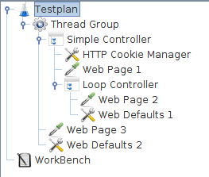
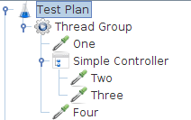

# 测试计划的各个组成元素

本节主要介绍 JMeter 测试计划的各个组成元素。

在 JMeter 中，一个测试至少要包含测试计划（Test Plan）、线程组（Thread Group）和一个或多个采样器（Sampler）。

## Test Plan 测试计划

测试计划对象有一个“**功能测试（Functional Testing）**”复选框，如果选中，JMeter 会记录测试过程中从服务器返回的数据，方便确认服务器是否返回预期的结果。同时在监听器（Listener）中可以选择将这些数据写入到一个文件中，但是需要注意的是，如果在测试中写入的文件快速增长变得非常大，会影响 JMeter 的性能，所以在做压力测试时，不建议将结果写入到文件中。

## Thread Group 线程组

线程组是测试计划的入口，它表示 JMeter 用于执行测试的线程数/用户数。所有控制器（Controller）都必须放在线程组下。其他元素，如监听器（Listener），如果放在线程组外，表示对所有线程组生效。

线程组可以进行以下设置：

- 设置启动线程数
- 设置在指定时间内启动所有线程（ramp-up period）
- 设置测试执行次数


Each thread will execute the test plan in its entirety and completely independently of other test threads. Multiple threads are used to simulate concurrent connections to your server application.

The ramp-up period tells JMeter how long to take to "ramp-up" to the full number of threads chosen. If 10 threads are used, and the ramp-up period is 100 seconds, then JMeter will take 100 seconds to get all 10 threads up and running. Each thread will start 10 (100/10) seconds after the previous thread was begun. If there are 30 threads and a ramp-up period of 120 seconds, then each successive thread will be delayed by 4 seconds.

Ramp-up needs to be long enough to avoid too large a work-load at the start of a test, and short enough that the last threads start running before the first ones finish (unless one wants that to happen).

Start with Ramp-up = number of threads and adjust up or down as needed.

By default, the thread group is configured to loop once through its elements.

Thread Group also allows to specify **Thread lifetime**. Click the checkbox at the bottom of the Thread Group panel to enable/disable extra fields in which you can enter the duration of test and the startup delay You can configure **Duration (seconds)** and **Startup Delay (seconds)** to control the duration of each thread group and the after how much seconds it starts. When the test is started, JMeter will wait **Startup Delay (seconds)** before starting the Threads of the Thread Group and run for the configured **Duration (seconds)** time.

## Controllers 控制器

控制器负责驱动测试的执行。JMeter 有两种控制器：采样器（Sampler）和逻辑控制器（Logic Controller）。

采样器负责向服务器发送请求。例如，如果想让 JMeter 发送一个 HTTP 请求，可以添加一个 HTTP 请求采样器（HTTP Request Sampler）。同时还可以通过向采样器中添加一个或多个配置元素（Configuration Element）来自定义请求。

逻辑控制器负责控制请求发送的逻辑（也就是采样器如何执行的逻辑）。例如交错逻辑控制器（Interleave Logic Controller）能让多个 HTTP 请求采样器交替执行。


参考：

[Samplers](https://jmeter.apache.org/usermanual/test_plan.html#samplers)

[Logical Controllers](https://jmeter.apache.org/usermanual/test_plan.html#logic_controller)

## Samplers 采样器

采样器负责向服务器发送请求并等待响应。采样器按照在测试计划树中出现的顺序来执行。

JMeter 有以下这些采样器：

- FTP Request
- HTTP Request (can be used for SOAP or REST Webservice also)
- JDBC Request
- Java object request
- JMS request
- JUnit Test request
- LDAP Request
- Mail request
- OS Process request
- TCP request

Each sampler has several properties you can set. You can further customize a sampler by adding one or more Configuration Elements to the Test Plan.


If you are going to send multiple requests of the same type (for example, HTTP Request) to the same server, consider using a Defaults Configuration Element. Each controller has one or more Defaults elements (see below).

Remember to add a Listener to your test plan to view and/or store the results of your requests to disk.

If you are interested in having JMeter perform basic validation on the response of your request, add an [Assertion](https://jmeter.apache.org/usermanual/test_plan.html#assertions) to the sampler. For example, in stress testing a web application, the server may return a successful "HTTP Response" code, but the page may have errors on it or may be missing sections. You could add assertions to check for certain HTML tags, common error strings, and so on. JMeter lets you create these assertions using regular expressions.


参考：

[JMeter Built-in Samplers](https://jmeter.apache.org/usermanual/component_reference.html#samplers)

## Logic Controllers 逻辑控制器

逻辑控制器负责控制请求发送的逻辑（也就是采样器如何执行的逻辑）。逻辑控制器可以修改请求、重复发送请求、交替发送请求、控制请求执行时间、改变请求顺序等。


To understand the effect of Logic Controllers on a test plan, consider the following test tree:

- Test Plan

- - Thread Group

  - - Once Only Controller

    - - Login Request (an [HTTP Request](https://jmeter.apache.org/usermanual/component_reference.html#HTTP_Request))

    - Load Search Page (HTTP Sampler)

    - Interleave Controller

    - - Search "A" (HTTP Sampler)
      - Search "B" (HTTP Sampler)
      - HTTP default request (Configuration Element)

    - HTTP default request (Configuration Element)

    - Cookie Manager (Configuration Element)


The first thing about this test is that the login request will be executed only the first time through. Subsequent iterations will skip it. This is due to the effects of the [Once Only Controller](https://jmeter.apache.org/usermanual/component_reference.html#Once_Only_Controller).

After the login, the next Sampler loads the search page (imagine a web application where the user logs in, and then goes to a search page to do a search). This is just a simple request, not filtered through any Logic Controller.

After loading the search page, we want to do a search. Actually, we want to do two different searches. However, we want to re-load the search page itself between each search. We could do this by having 4 simple HTTP request elements (load search, search "A", load search, search "B"). Instead, we use the [Interleave Controller](https://jmeter.apache.org/usermanual/component_reference.html#Interleave_Controller) which passes on one child request each time through the test. It keeps the ordering (i.e. it doesn't pass one on at random, but "remembers" its place) of its child elements. Interleaving 2 child requests may be overkill, but there could easily have been 8, or 20 child requests.

Note the [HTTP Request Defaults](https://jmeter.apache.org/usermanual/component_reference.html#HTTP_Request_Defaults) that belongs to the Interleave Controller. Imagine that "Search A" and "Search B" share the same PATH info (an HTTP request specification includes domain, port, method, protocol, path, and arguments, plus other optional items). This makes sense - both are search requests, hitting the same back-end search engine (a servlet or cgi-script, let's say). Rather than configure both HTTP Samplers with the same information in their PATH field, we can abstract that information out to a single Configuration Element. When the Interleave Controller "passes on" requests from "Search A" or "Search B", it will fill in the blanks with values from the HTTP default request Configuration Element. So, we leave the PATH field blank for those requests, and put that information into the Configuration Element. In this case, this is a minor benefit at best, but it demonstrates the feature.

The next element in the tree is another HTTP default request, this time added to the Thread Group itself. The Thread Group has a built-in Logic Controller, and thus, it uses this Configuration Element exactly as described above. It fills in the blanks of any Request that passes through. It is extremely useful in web testing to leave the DOMAIN field blank in all your HTTP Sampler elements, and instead, put that information into an HTTP default request element, added to the Thread Group. By doing so, you can test your application on a different server simply by changing one field in your Test Plan. Otherwise, you'd have to edit each and every Sampler.


参考：

[JMeter Built-in Logic Controllers](https://jmeter.apache.org/usermanual/component_reference.html#logic_controllers)

[JMeter元件详解之逻辑控制器](https://blog.csdn.net/mu_wind/article/details/91879280)

## Test Fragments 测试片段

测试片段是用作代码重用的特殊控制器，和线程组（Thread Group）处于同一级，只有被 [Module Controller](https://jmeter.apache.org/usermanual/component_reference.html#Module_Controller) 或 [Include_Controller](https://jmeter.apache.org/usermanual/component_reference.html#Include_Controller) 所引用才会被执行。

## Listeners 监听器

监听器负责收集和显示测试执行信息。比如 [Graph Results](https://jmeter.apache.org/usermanual/component_reference.html#Graph_Results) 监听器负责将响应时间绘制在成图，[View Results Tree](https://jmeter.apache.org/usermanual/component_reference.html#View_Results_Tree) 监听器负责显示采样器（Sampler）请求和响应的详细信息，也可以将响应以 HTML 和 XML 形式显示。其他监听器负责统计和聚合信息。

监听器能够将收集到的数据保存到文件中。需要注意的是，所有的监听器保存的数据都是相同的，唯一不同的是显示的方式不一样。

监听器可以添加到测试中的任何位置，包括直接在测试计划下。它只收集和它同级或同级以下的测试数据。

### [View Results Tree](https://jmeter.apache.org/usermanual/component_reference.html#View_Results_Tree)

### [Graph Results](https://jmeter.apache.org/usermanual/component_reference.html#Graph_Results)


参考：https://jmeter.apache.org/usermanual/component_reference.html#listeners

## Timers 定时器

计时器负责在每个采样器执行前延迟一定的时间再执行。

By default, a JMeter thread executes samplers in sequence without pausing. We recommend that you specify a delay by adding one of the available timers to your Thread Group. If you do not add a delay, JMeter could overwhelm your server by making too many requests in a very short amount of time。

If you choose to add more than one timer to a Thread Group, JMeter takes the sum of the timers and pauses for that amount of time before executing the samplers to which the timers apply. Timers can be added as children of samplers or controllers in order to restrict the samplers to which they are applied.

To provide a pause at a single place in a test plan, one can use the [Flow Control Action](https://jmeter.apache.org/usermanual/component_reference.html#Flow_Control_Action) Sampler.

## Assertions 断言

断言用于判断服务器返回的响应是否和预期一致。

For instance, you can assert that the response to a query will contain some particular text. The text you specify can be a Perl-style regular expression, and you can indicate that the response is to contain the text, or that it should match the whole response.

You can add an assertion to any Sampler. For example, you can add an assertion to a HTTP Request that checks for the text, "**</HTML>**". JMeter will then check that the text is present in the HTTP response. If JMeter cannot find the text, then it will mark this as a failed request.

Note that assertions apply to all samplers which are in their [scope](https://jmeter.apache.org/usermanual/test_plan.html#scoping_rules). To restrict an assertion to a single sampler, add the assertion as a child of the sampler.

To view assertion results, add an Assertion Listener to the Thread Group. Failed Assertions will also show up in the Tree View and Table Listeners, and will count towards the error %age for example in the Aggregate and Summary reports.

## Configuration Elements 配置元素

A configuration element works closely with a Sampler. Although it does not send requests (except for [HTTP(S) Test Script Recorder](https://jmeter.apache.org/usermanual/component_reference.html#HTTP(S)_Test_Script_Recorder)), it can add to or modify requests.

A configuration element is accessible from only inside the tree branch where you place the element. For example, if you place an HTTP Cookie Manager inside a Simple Logic Controller, the Cookie Manager will only be accessible to HTTP Request Controllers you place inside the Simple Logic Controller (see figure 1). The Cookie Manager is accessible to the HTTP requests "Web Page 1" and "Web Page 2", but not "Web Page 3".

Also, a configuration element inside a tree branch has higher precedence than the same element in a "parent" branch. For example, we defined two HTTP Request Defaults elements, "Web Defaults 1" and "Web Defaults 2". Since we placed "Web Defaults 1" inside a Loop Controller, only "Web Page 2" can access it. The other HTTP requests will use "Web Defaults 2", since we placed it in the Thread Group (the "parent" of all other branches).

[](https://jmeter.apache.org/images/screenshots/http-config/http-config-example.png)Figure 1 - Test Plan Showing Accessibility of Configuration Elements


### [HTTP Request Properties](https://jmeter.apache.org/usermanual/component_reference.html#HTTP_Header_Manager)

HTTP Request Properties 负责设置 HTTP 请求的默认属性。

### [User Defined Variables](https://jmeter.apache.org/usermanual/component_reference.html#User_Defined_Variables)

User Defined Variables 在测试开始时被执行，不管它放在哪里。为简单起见，建议只将它放置在线程组（Thread Group）的开头。

### [HTTP Cookie Manager](https://jmeter.apache.org/usermanual/component_reference.html#HTTP_Cookie_Manager)

建议所有 Web 测试添加一个 HTTP Cookie Manager，否则 JMeter 会忽略 Cookie。推荐在线程组（ Thread Group）中添加，这样可以确保所有 HTTP 请求共享相同的 Cookie。

### [HTTP Header Manager](https://jmeter.apache.org/usermanual/component_reference.html#HTTP_Header_Manager)

HTTP Header Manager 负责定制 HTTP 请求的头部，和 HTTP Cookie Manager 一样建议所有 Web 测试都添加一个。

## Pre-Processor Elements 前置处理器

A Pre-Processor executes some action prior to a Sampler Request being made. If a Pre-Processor is attached to a Sampler element, then it will execute just prior to that sampler element running. A Pre-Processor is most often used to modify the settings of a Sample Request just before it runs, or to update variables that aren't extracted from response text. See the [**scoping rules**](https://jmeter.apache.org/usermanual/test_plan.html#scoping_rules) for more details on when Pre-Processors are executed.

## Post-Processor Elements 后置处理器

A Post-Processor executes some action after a Sampler Request has been made. If a Post-Processor is attached to a Sampler element, then it will execute just after that sampler element runs. A Post-Processor is most often used to process the response data, often to extract values from it. See the [**scoping rules**](https://jmeter.apache.org/usermanual/test_plan.html#scoping_rules) for more details on when Post-Processors are executed.

## Execution order 执行顺序

1. Configuration elements
2. Pre-Processors
3. Timers
4. Sampler
5. Post-Processors (unless SampleResult is **null**)
6. Assertions (unless SampleResult is **null**)
7. Listeners (unless SampleResult is **null**)

Please note that Timers, Assertions, Pre- and Post-Processors are only processed if there is a sampler to which they apply. Logic Controllers and Samplers are processed in the order in which they appear in the tree. Other test elements are processed according to the scope in which they are found, and the type of test element. [Within a type, elements are processed in the order in which they appear in the tree].

For example, in the following test plan:

- Controller

- - Post-Processor 1
  - Sampler 1
  - Sampler 2
  - Timer 1
  - Assertion 1
  - Pre-Processor 1
  - Timer 2
  - Post-Processor 2

The order of execution would be:

```
Pre-Processor 1
Timer 1
Timer 2
Sampler 1
Post-Processor 1
Post-Processor 2
Assertion 1

Pre-Processor 1
Timer 1
Timer 2
Sampler 2
Post-Processor 1
Post-Processor 2
Assertion 1
```


## Scoping Rules 范围限定规则

The JMeter test tree contains elements that are both hierarchical and ordered. Some elements in the test trees are strictly hierarchical (Listeners, Config Elements, Post-Processors, Pre-Processors, Assertions, Timers), and some are primarily ordered (controllers, samplers). When you create your test plan, you will create an ordered list of sample request (via Samplers) that represent a set of steps to be executed. These requests are often organized within controllers that are also ordered. Given the following test tree:

Example test tree

The order of requests will be, One, Two, Three, Four.

Some controllers affect the order of their subelements, and you can read about these specific controllers in [the component reference](https://jmeter.apache.org/usermanual/component_reference.html).

Other elements are hierarchical. An Assertion, for instance, is hierarchical in the test tree. If its parent is a request, then it is applied to that request. If its parent is a Controller, then it affects all requests that are descendants of that Controller. In the following test tree:

Hierarchy example

Assertion #1 is applied only to Request One, while Assertion #2 is applied to Requests Two and Three.

Another example, this time using Timers:

complex example

In this example, the requests are named to reflect the order in which they will be executed. Timer #1 will apply to Requests Two, Three, and Four (notice how order is irrelevant for hierarchical elements). Assertion #1 will apply only to Request Three. Timer #2 will affect all the requests.

Hopefully these examples make it clear how configuration (hierarchical) elements are applied. If you imagine each Request being passed up the tree branches, to its parent, then to its parent's parent, etc., and each time collecting all the configuration elements of that parent, then you will see how it works.

The Configuration elements Header Manager, Cookie Manager and Authorization manager are treated differently from the Configuration Default elements. The settings from the Configuration Default elements are merged into a set of values that the Sampler has access to. However, the settings from the Managers are not merged. If more than one Manager is in the scope of a Sampler, only one Manager is used, but there is currently no way to specify *which* is used.

## Properties and Variables 属性和变量

JMeter *properties* are defined in **jmeter.properties** (see [Getting Started - Configuring JMeter](https://jmeter.apache.org/usermanual/get-started.html#configuring_jmeter) for more details).
Properties are global to jmeter, and are mostly used to define some of the defaults JMeter uses. For example the property **remote_hosts** defines the servers that JMeter will try to run remotely. Properties can be referenced in test plans - see [Functions - read a property](https://jmeter.apache.org/usermanual/functions.html#__property) - but cannot be used for thread-specific values.

JMeter *variables* are local to each thread. The values may be the same for each thread, or they may be different.
If a variable is updated by a thread, only the thread copy of the variable is changed. For example the [Regular Expression Extractor](https://jmeter.apache.org/usermanual/component_reference.html#Regular_Expression_Extractor) Post-Processor will set its variables according to the sample that its thread has read, and these can be used later by the same thread. For details of how to reference variables and functions, see [Functions and Variables](https://jmeter.apache.org/usermanual/functions.html)

Note that the values defined by the [Test Plan](https://jmeter.apache.org/usermanual/component_reference.html#Test_Plan) and the [User Defined Variables](https://jmeter.apache.org/usermanual/component_reference.html#User_Defined_Variables) configuration element are made available to the whole test plan at startup. If the same variable is defined by multiple UDV elements, then the last one takes effect. Once a thread has started, the initial set of variables is copied to each thread. Other elements such as the [User Parameters](https://jmeter.apache.org/usermanual/component_reference.html#User_Parameters) Pre-Processor or [Regular Expression Extractor](https://jmeter.apache.org/usermanual/component_reference.html#Regular_Expression_Extractor) Post-Processor may be used to redefine the same variables (or create new ones). These redefinitions only apply to the current thread.

The [setProperty](https://jmeter.apache.org/usermanual/functions.html#__setProperty) function can be used to define a JMeter property. These are global to the test plan, so can be used to pass information between threads - should that be needed.

Both variables and properties are case-sensitive.

## 使用变量对测试进行参数化

Variables don't have to vary - they can be defined once, and if left alone, will not change value. So you can use them as short-hand for expressions that appear frequently in a test plan. Or for items which are constant during a run, but which may vary between runs. For example, the name of a host, or the number of threads in a thread group.

When deciding how to structure a Test Plan, make a note of which items are constant for the run, but which may change between runs. Decide on some variable names for these - perhaps use a naming convention such as prefixing them with **C_** or **K_** or using uppercase only to distinguish them from variables that need to change during the test. Also consider which items need to be local to a thread - for example counters or values extracted with the Regular Expression Post-Processor. You may wish to use a different naming convention for these.

For example, you might define the following on the Test Plan:

```
HOST             www.example.com
THREADS          10
LOOPS            20
```

You can refer to these in the test plan as **${HOST}** **${THREADS}** etc. If you later want to change the host, just change the value of the **HOST** variable. This works fine for small numbers of tests, but becomes tedious when testing lots of different combinations. One solution is to use a property to define the value of the variables, for example:

```
HOST             ${__P(host,www.example.com)}
THREADS          ${__P(threads,10)}
LOOPS            ${__P(loops,20)}
```

You can then change some or all of the values on the command-line as follows:

```
jmeter … -Jhost=www3.example.org -Jloops=13
```


## 参考

https://jmeter.apache.org/usermanual/test_plan.html

https://jmeter.apache.org/usermanual/component_reference.html

# *术语表

运行时间（**Elapsed time**）。指从发送请求之前到接收到最后一个响应之后所需的时间，不包括响应渲染所需的时间，JMeter 也不会处理任何客户端代码（如 Javascript）

## 参考

https://jmeter.apache.org/usermanual/glossary.html