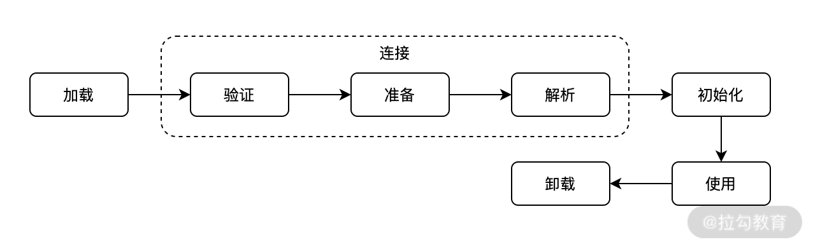
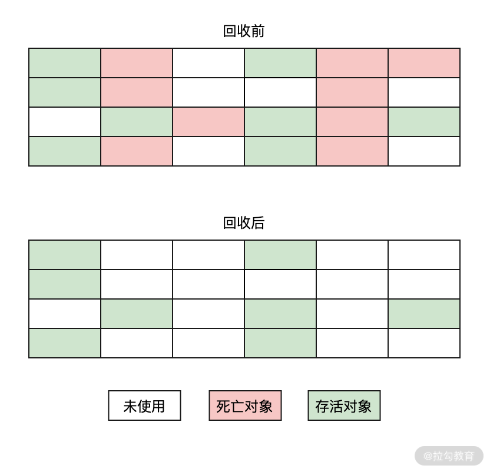
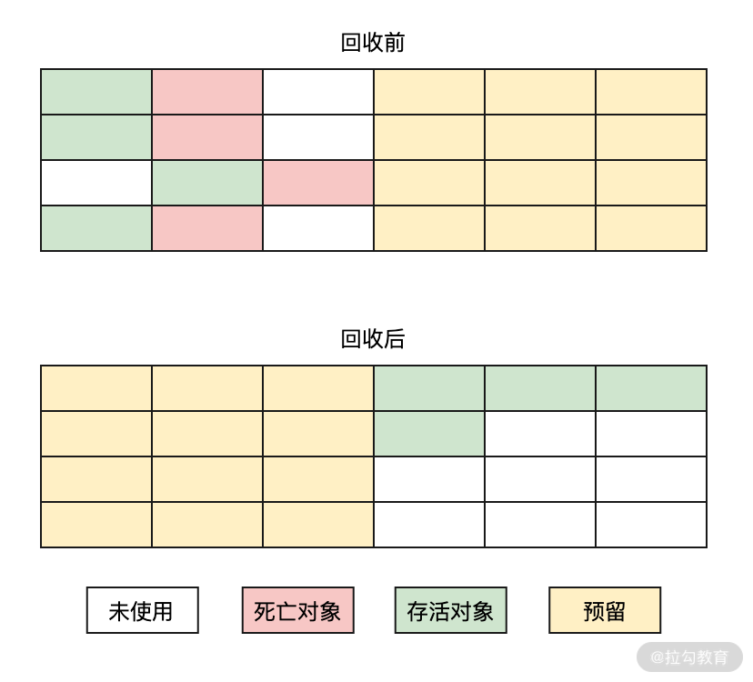
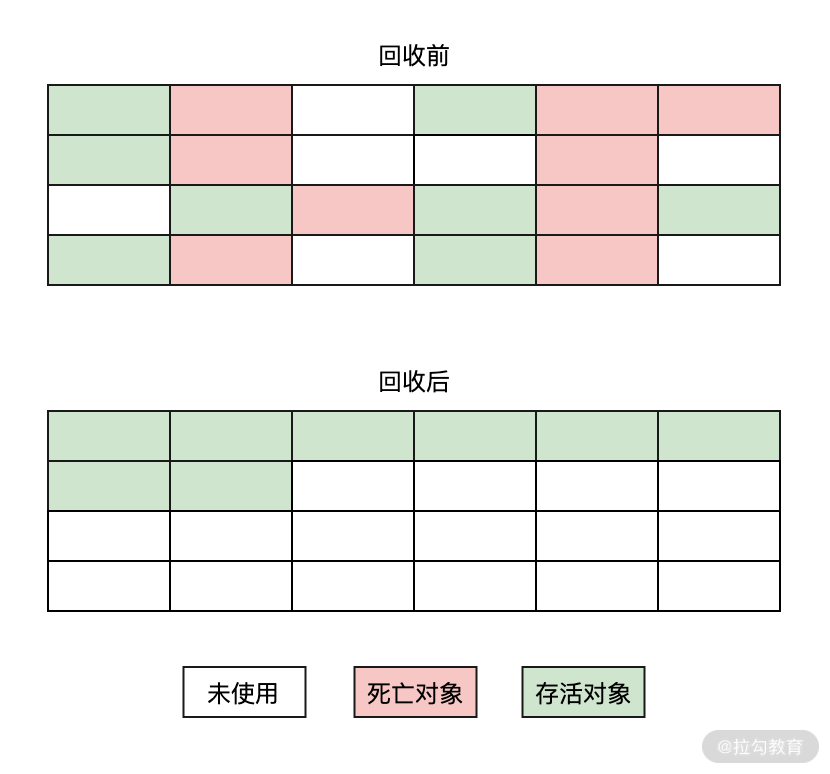
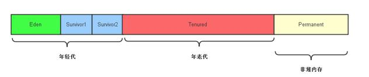

[TOC]


## *类加载的过程

类加载过程主要分为三个阶段：加载、连接、初始化



- **加载(Loading)**：根据类的全限定名称将**类的字节流**从**不同的数据源**读取到 JVM 中，转换为**方法区**运行时的数据结构，并创建该类的 **Class 对象**。这里的数据源包括 jar 包、class 文件，甚至是网络数据源等。

  这个阶段用户可以通过自定义类加载器去实现自己的加载过程。

- 连接(Linking)：将加载到 JVM 中的二进制字节流的类数据信息合并到 JVM 的运行时状态中。

  - 验证(Verification)：验证类信息是否**符合 JVM 规范**，是否是一个**有效**的字节码文件
  - 准备(Preparation)：为类中的**静态变量**分配内存空间，并设置初始值（由于还没有产生对象，实例变量不在此操作范围内）
  - 解析(Resolution)：此阶段主要是用来解析类、接口、字段及方法的，解析时会把**符号引用替换成直接引用**。

- 初始化(Initializing)：执行类初始化的代码逻辑，包括给静态变量赋值、执行静态代码块。

参考：

1. [第23讲：说一下 JVM 的内存布局和运行原理？](https://kaiwu.lagou.com/course/courseInfo.htm?courseId=59#/detail/pc?id=1783)
2. [Chapter 5. Loading, Linking, and Initializing](https://docs.oracle.com/javase/specs/jvms/se8/html/jvms-5.html)
3. https://www.cnblogs.com/xiaoxian1369/p/5498817.html

## 类的生命周期

类从被加载到 JVM 中开始，到卸载为止，整个生命周期包括：加载、验证、准备、解析、初始化、使用和卸载七个阶段。

## 双亲委派模型

双亲委派模型，简单说就是当一个类加载器（ClassLoader）试图加载某个类时，会优先委派给父类加载器去加载（而父类加载器又会交给它的父类加载器去处理，所以最终会传递到 BootstrapClassLoader 去处理），如果父类加载器无法加载这个类时，才由自己来处理。

这样的目的是避免某个类被重复加载。

## JVM 内存模型

线程私有

- 程序计数器（Program Counter Register）是**线程私有**的一块内存区域，表示当前线程所执行的字节码的行号指示器。
- Java 虚拟机栈（Java Virtual Machine Stacks）是**线程私有**的一块内存区域，线程执行的每个 Java 方法在虚拟机栈中都会创建一个栈帧（Stack Frame ），用于存放方法入参、局部变量（包括对象的引用）等数据。
- 本地方法栈（Native Method Stacks）与虚拟机栈的作用相同，只不过前者是 Java 方法，而后者是本地方法。

线程共享

- Java 堆（Java Heap）是**线程共享**的一块内存区域，用于存放对象实例、数组。另外需要注意一点，垃圾回收是作用在堆上的。**堆的大小可以通过 -Xms 和 -Xmx 来设置**，当堆超过最大值时，会抛出 OOM(OutOfMemeryError) 异常。
- 方法区（Method Area）是**线程共享**的一块内存区域，用于存放已被虚拟机加载的类信息、类变量、常量等数据。
- 运行时常量池（Runtime Constant Pool），它是方法区的一部分，用于存放编译期生成的各种字面量和符号引用。

## 堆和栈的区别

- 堆存放对象的实例、数组等数据，栈是用来存放对象的引用、方法入参、局部变量等数据
- 堆有垃圾回收，栈没有
- 堆需要手动申请和释放，栈由系统自动分配和释放（貌似是C++的吧）

## 值传递与引用传递

值传递是传递**变量**的值，引用传递时传递**对象**的引用地址。基本数据类型是值传递，引用数据类型是引用传递（地址传递）。

对于这类问题，应该结合 JVM 内存模型中的虚拟机栈和堆来看。

参考：

[JAVA中值传递和引用传递的三种情况](https://blog.csdn.net/zhzhao999/article/details/53449504)

[java中的值传递和引用传递问题](https://www.cnblogs.com/coderising/p/5697986.html)

## 如何判断一个对象是否“死亡”?

垃圾回收器在回收一个对象之前，需要判断这个对象是否“死亡”。

判断一个对象是否为死亡状态的常用算法有两个：引用计数器算法和可达性分析算法

- 引用计数器算法（Reference Counting）：垃圾收集器最早实现算法，它在创建对象时会关联一个与之相对应的计数器，当此对象被使用时加 1，相反销毁时 -1。当此计数器为 0 时，则表示此对象未使用，可以被垃圾收集器回收。

  优点：垃圾回收比较及时，实时性比较高，只要对象计数器为 0，则可以直接进行回收操作

  缺点：无法解决循环引用的问题

- 可达性分析算法（Reachability Analysis）：目前商业系统中所采用的判断对象死亡的常用算法，它会从对象的起点（**GC Roots**）开始向下搜索，如果对象到 GC Roots 没有任何引用链相连时，也就是说此对象到 GC Roots **不可达**时，则表示此对象可以被垃圾回收器所回收

参考：

https://kaiwu.lagou.com/course/courseInfo.htm?courseId=59#/detail/pc?id=1784

## 垃圾回收的算法有哪些?

垃圾回收的常见算法有以下几个：

- 标记-清除算法（Mark-Sweep）：最早的垃圾回收算法，它是由标记阶段和清除阶段构成的。标记阶段会给所有的存活对象做上标记，而清除阶段会把没有被标记的死亡对象进行回收。而标记的判断方法就是前面讲的引用计数器算法和可达性分析算法。

  缺点：会产生大量的不连续内存，造成内存空间碎片化，这样当程序需要给一个大对象分配内存空间时，因为没有足够的连续内存而提前触发一次垃圾回收

  适合场景：死亡对象比较少的场景（不用清除那么多）

  

- 标记-复制算法：是标记-清除算法的一个升级，使用它可以有效地解决内存碎片化的问题。它是将内存分为大小相同的两块区域，每次只使用其中的一块区域，这样在进行垃圾回收时就可以将存活的对象直接复制到新的内存上，然后再把另一块内存全部清理掉。这样就不会产生内存碎片的问题了

  缺点：因为需要将内存分为大小相同的两块内存，那么内存的实际可用量其实只有原来的一半，这样此算法导致了**内存的可用率大幅降低**了。

  适合场景：存活对象比较少的场景（不用复制那么多）

  

- 标记-整理|压缩算法（Mark-Compact）：它在标记-清除算法的基础上做了一些优化，不是直接对内存进行清除，而是**把所有存活的对象移动到内存的一端，然后把另一端的所有死亡对象全部清除**。（相当于 Windows 的磁盘碎片整理一样。）

  适合场景：适合死亡对象比较少的场景（不用整理那么多）
  
  
  
  

- 分代回收算法：分代收集算法就是目前虚拟机使用的回收算法，它将堆划分为新生代和老年代，在堆外还有一个永久代。**它在不同年代使用不同的算法**。新生代对象存活率低，则使用标记-复制算法；而老年代对象存活率高，则使用标记-清除或者标记-整理算法。

  老年代内存里包含了长期存活的对象和经过多次 Minor GC 后依然存活下来的对象。

参考：

https://kaiwu.lagou.com/course/courseInfo.htm?courseId=59#/detail/pc?id=1784

## 垃圾回收机制

堆的分代内存分配如下：



新生代分为 Eden(亚当) 区和 Survivor 区（有两块，from 和 to），且 `Eden:from:to = 8:1:1`。

1. 新产生的对象优先分配在 Eden 区

2. 当 Eden 区满了或放不下了，就会将其中存活的对象会复制到 from 区，并清空 Eden 区；

3. 当 Eden 和 from 区都满了或放不下了，就会将其中存活的对象会复制到 to 区，并清空 Eden 和 from 区；

4. 当 Eden、from 和 to 区都满了或放不下了，就会将其中存活的对象会复制到老年代区，并清空 Eden、from 和 to 区；
5. 当老年代区满了或存放不下了，就会触发一次 Full GC，回收新生代和老生代的死亡对象。

参考：

[直通BAT必考题系列：JVM的4种垃圾回收算法、垃圾回收机制与总结](https://youzhixueyuan.com/jvm-garbage-collection-algorithm.html)

## 垃圾回收类型

垃圾回收有两种类型：Minor GC 和 Full GC。 

- Minor GC

  对新生代进行回收，不会影响到年老代。因为新生代的 Java 对象大多死亡频繁，所以 Minor GC 非常频繁，一般在这里使用速度快、效率高的算法，使垃圾回收能尽快完成。

- Full GC

  也叫 Major GC，对整个堆进行回收，包括新生代和老年代。由于 Full GC 需要对整个堆进行回收，所以比Minor GC 要慢，因此应该尽可能减少 Full GC 的次数。

  Full GC 的原因包括：老年代被写满、永久代被写满、 `System.gc()` 被显式调用等。

参考：

1. [直通BAT必考题系列：JVM的4种垃圾回收算法、垃圾回收机制与总结](https://youzhixueyuan.com/jvm-garbage-collection-algorithm.html)

2. [直通BAT JVM必考题：Minor GC、Major GC、Full GC的区别](https://youzhixueyuan.com/the-difference-between-minor-gc-major-gc-full-gc.html)

## 垃圾回收器有哪些？

新生代的垃圾收集器：

- Serial 串行收集器

  最早的垃圾收集器，它是单线程运行，在进行垃圾回收时所有的工作线程必须全部暂停，直到垃圾回收结束为止。它的特点是简单和高效，并且本身的运行对内存要求不高，因此它在**客户端**模式下使用的比较多。

- ParNew

  Serial 串行收集器的多线程版本，有多个垃圾回收线程，在进行垃圾回收时所有的工作线程**还是要**全部暂停。

- Parallel Scavenge 并行收集器，也叫吞吐量收集器

  和 ParNew 一样也是多线程运行，但是该收集器追求**可控制的吞吐量**。所谓吞吐量就是CPU用于运行用户代码的时间与CPU总消耗时间的比值，即 `吞吐量=运行用户代码时间/(运行用户代码时间+垃圾收集时间)` ，

老年代的垃圾收集器：

- Serial Old 串行收集器的**老年代版本**

- Parallel Old 并行收集器|吞吐量收集器的**老年代版本**

- CMS(Concurrent Mark Sweep) 收集器

  该收集器追求最短停顿时间，主要应用在服务端，因为服务器追求更短的**停顿时间**、更快的**响应速度**，从而给用户带来更好的**交互体验**。

  注意，顾名思义，该垃圾收集器采用的是标记-清除算法。

混合的垃圾收集器，适合新生代和老年代：

- G1(Garbage First) 收集器

  JDK7 新增的垃圾收集器，用于取代 CMS 收集器，JDK9 之后成为了默认收集器

- ZGC 收集器

  JDK11 新增的垃圾收集器


参考：

1. [直通BAT必考题系列：7种JVM垃圾收集器特点，优劣势、及使用场景](https://youzhixueyuan.com/jvm-garbage-collector.html)
2. [第25讲：你用过哪些垃圾回收器？它们有什么区别？](https://kaiwu.lagou.com/course/courseInfo.htm?courseId=59#/detail/pc?id=1785)

## 作为 GC Roots 的对象有哪些？

**什么是 GC Roots**？垃圾回收器在扫描对象的引用链时会以某个对象的引用作为起点向下扫描，这个起点就叫做 GC Roots。（我编的）


在 Java 中可以作为 GC Roots 的对象(确切的说是引用)，主要包含以下几个：

- 虚拟机栈中，对象的引用；
- 本地方法栈中，对象的引用；
- 方法区中，静态变量的引用。
- 方法区中，常量对象的引用。
- 还有其它的

参考：

https://kaiwu.lagou.com/course/courseInfo.htm?courseId=59#/detail/pc?id=1784

https://www.jianshu.com/p/8592ea9a408c

## *JVM 性能调优

JVM 调优主要的目的是减少 GC 的频率和 Full GC 的次数

参考：[直通BAT必考题系列：JVM性能调优的6大步骤，及关键调优参数详解](https://youzhixueyuan.com/jvm-performance-optimization.html)

## JVM 监控工具

[JVM性能调优监控工具专题一：JVM自带性能调优工具（jps,jstack,jmap,jhat,jstat,hprof)](https://www.iteye.com/blog/josh-persistence-2161848)

### jps：打印 Java 进程状态信息

jps -l 打印 Java 进程状态信息，-m 打印 main 方法的入参，-v 打印 JVM 的参数

```shell
[root@10 ~]# jps -l
24226 arthas-demo.jar
25598 sun.tools.jps.Jps
[root@10 ~]# jps -lm
24226 arthas-demo.jar
25609 sun.tools.jps.Jps -lm
[root@10 ~]# jps -lv
24226 arthas-demo.jar
25621 sun.tools.jps.Jps -Dapplication.home=/usr/lib/jvm/java-1.8.0-openjdk-1.8.0.222.b10-1.el7_7.x86_64 -Xms8m
```


### jstack：查看 Java 进程内线程的堆栈信息，诊断死锁

下面的结果可以看出该进程有 8 个线程

```shell
[root@10 ~]# jstack 24226
2019-09-26 13:38:36
Full thread dump OpenJDK 64-Bit Server VM (25.222-b10 mixed mode):

"Attach Listener" #8 daemon prio=9 os_prio=0 tid=0x00007f7354001000 nid=0x5f86 waiting on condition [0x0000000000000000]
   java.lang.Thread.State: RUNNABLE

"Service Thread" #7 daemon prio=9 os_prio=0 tid=0x00007f737c13e800 nid=0x5eaa runnable [0x0000000000000000]
   java.lang.Thread.State: RUNNABLE

"C1 CompilerThread1" #6 daemon prio=9 os_prio=0 tid=0x00007f737c13b800 nid=0x5ea9 waiting on condition [0x0000000000000000]
   java.lang.Thread.State: RUNNABLE

"C2 CompilerThread0" #5 daemon prio=9 os_prio=0 tid=0x00007f737c12d000 nid=0x5ea8 waiting on condition [0x0000000000000000]
   java.lang.Thread.State: RUNNABLE

"Signal Dispatcher" #4 daemon prio=9 os_prio=0 tid=0x00007f737c12a800 nid=0x5ea7 runnable [0x0000000000000000]
   java.lang.Thread.State: RUNNABLE

"Finalizer" #3 daemon prio=8 os_prio=0 tid=0x00007f737c101000 nid=0x5ea6 in Object.wait() [0x00007f736c3de000]
   java.lang.Thread.State: WAITING (on object monitor)
        at java.lang.Object.wait(Native Method)
        - waiting on <0x00000000e3408ed8> (a java.lang.ref.ReferenceQueue$Lock)
        at java.lang.ref.ReferenceQueue.remove(ReferenceQueue.java:144)
        - locked <0x00000000e3408ed8> (a java.lang.ref.ReferenceQueue$Lock)
        at java.lang.ref.ReferenceQueue.remove(ReferenceQueue.java:165)
        at java.lang.ref.Finalizer$FinalizerThread.run(Finalizer.java:216)

"Reference Handler" #2 daemon prio=10 os_prio=0 tid=0x00007f737c0fc000 nid=0x5ea5 in Object.wait() [0x00007f736c4df000]
   java.lang.Thread.State: WAITING (on object monitor)
        at java.lang.Object.wait(Native Method)
        - waiting on <0x00000000e3406c00> (a java.lang.ref.Reference$Lock)
        at java.lang.Object.wait(Object.java:502)
        at java.lang.ref.Reference.tryHandlePending(Reference.java:191)
        - locked <0x00000000e3406c00> (a java.lang.ref.Reference$Lock)
        at java.lang.ref.Reference$ReferenceHandler.run(Reference.java:153)

"main" #1 prio=5 os_prio=0 tid=0x00007f737c04b800 nid=0x5ea3 waiting on condition [0x00007f738362b000]
   java.lang.Thread.State: TIMED_WAITING (sleeping)
        at java.lang.Thread.sleep(Native Method)
        at java.lang.Thread.sleep(Thread.java:340)
        at java.util.concurrent.TimeUnit.sleep(TimeUnit.java:386)
        at demo.MathGame.main(MathGame.java:17)

"VM Thread" os_prio=0 tid=0x00007f737c0f2800 nid=0x5ea4 runnable

"VM Periodic Task Thread" os_prio=0 tid=0x00007f737c141000 nid=0x5eab waiting on condition

JNI global references: 5
```


### jmap：查看 Java 进程堆内存使用状况

一般使用 `jmap -heap pid` 命令来查看，另外还会使用 `jmap -dump:format=b,file=dumpFileName pid` 命令将进程内存 dump 到文件中，再配合 jhat 或 VisualVM 分析。

### jstat：JVM 统计监控工具，查看 GC 信息

```
jstat pid [interval[s|ms] [count]] ]
```

interval 是采样时间间隔。count 是采样数目。比如下面输出的是GC信息，采样时间间隔为250ms，采样数为4：

```shell
root@ubuntu:/# jstat -gc 21711 250 4 
S0C    S1C    S0U    S1U      EC       EU        OC         OU       PC     PU    YGC     YGCT    FGC    FGCT     GCT   
192.0  192.0   64.0   0.0    6144.0   1854.9   32000.0     4111.6   55296.0 25472.7    702    0.431   3      0.218    0.649
192.0  192.0   64.0   0.0    6144.0   1972.2   32000.0     4111.6   55296.0 25472.7    702    0.431   3      0.218    0.649
192.0  192.0   64.0   0.0    6144.0   1972.2   32000.0     4111.6   55296.0 25472.7    702    0.431   3      0.218    0.649
192.0  192.0   64.0   0.0    6144.0   2109.7   32000.0     4111.6   55296.0 25472.7    702    0.431   3      0.218    0.649
```


### *图形化监控工具：jconsole，jmc，jvisualvm


## 找出某个Java进程中最耗费CPU的线程并打印堆栈信息

1. `jps -l` 查看 Java 进程的 `pid` 
2. `top -Hp pid` 查看指定进程的所有线程，从 TIME+ 列中找到最耗时的线程ID作为 `thread_pid` 。其中 `-H` 是线程模式，-p 指定进程的 `pid` 
3. `printf '%x\n' thread_pid` 将线程ID 转为 16 进制，其中 `%x` 表示十六进制
4. `jstack pid | grep thread_pid` 查看线程的堆栈信息


