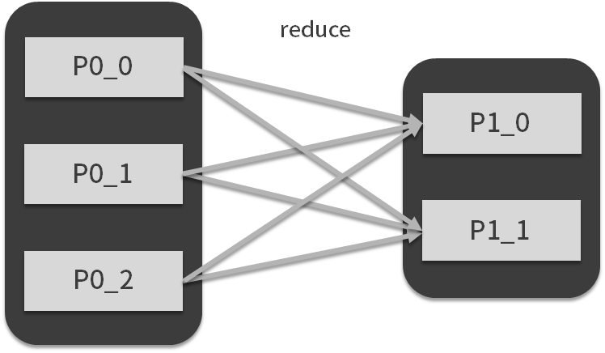

# 模块一：基础预习

## [第01讲： MapReduce：计算框架和编程模型](https://kaiwu.lagou.com/course/courseInfo.htm?courseId=71#/detail/pc?id=1972)

### Google 的三驾马车

从 2003 年到 2006 年，Google 分别在 ODSI 与 SOSP 发表了 3 篇论文，引起了业界对于分布式系统的广泛讨论，这三篇论文分别是：

- SOSP2003：The Google File System；
- ODSI2004：MapReduce: Simplifed Data Processing on Large Clusters；
- ODSI2006：Bigtable: A Distributed Storage System for Structured Data。

这 3 篇论文被称为 Google 的三驾马车，代表 Google 大数据处理的基石、云计算的基础。

第 1 篇论文主要讨论**分布式文件系统**（开源实现为 HDFS），第 2 篇论文主要讨论的**分布式计算框架**（开源实现为 MapReduce、Spark），第 3 篇论文则主要讨论**分布式数据存储**（开源实现为  HBase）。

### MapReduce 编程模型与计算框架

MapReduce 既是编程模型又是计算框架。

MapReduce 模型将数据处理方式抽象为 map 和 reduce：

- map 被称为映射，顾名思义，它表现的是数据的一对一映射，通常完成数据转换的工作。

  

- reduce 被称为归约，它表示另外一种映射方式（多变少），通常完成聚合的工作

  

MapReduce 认为，再复杂的数据处理流程也无非是这两种映射方式的组合

## [第02讲：Hadoop：集群的操作系统](https://kaiwu.lagou.com/course/courseInfo.htm?courseId=71#/detail/pc?id=1973)

### Hadoop 版本变化

| Hadoop 版本 |                                                              |      |
| ----------- | ------------------------------------------------------------ | ---- |
| Hadoop 1.0  | 分布式文件系统（HDFS）的上层是分布式计算框架（MapReduce）    |      |
| Hadoop 2.0  | 引入资源管理与调度系统 YARN，YARN 向上兼容多个计算框架（Spark、Storm 等）。YARN 管理计算资源（CPU 和内存），YARN 的下层是 HDFS，HDFS 管理存储资源。 |      |
| Hadoop 3.0  | 区别不大                                                     |      |

附 Hadoop 生态图：

- Sqoop 负责批量数据抽取
- Flume 负责流式数据传输
- Ganglia 负责集群监控

- Zookeeper 负责分布式协调（和事佬）
- Ambari 负责部署

### Hadoop 发行版

- Hortonworks 的 HDP（推荐这个）
- Clouera 的 CDH

两家最后合并了

## 第04讲：解析 Spark 数据处理与分析场景

### 数据处理的场景

按照大数据的作业类型，分为：批处理和流处理

按照结果响应时间，分为离线和在线，其中在线又可以划分为两种，OLTP 和 OLAP

- OLTP（Online Transaction Processing）通常指的是业务系统中常见的事务处理，对应数据库的增删改查操作
- OLAP（Online Analytic Processing）主要指的是在线分析处理，对应数据库的查询操作，但不仅限于数据库，主要帮助分析人员可以迅速地、一致地、可交互地查询数据，也被称作交互式查询。

# 模块二：Spark 编程

## [第06讲：Spark 抽象、架构与运行环境](https://kaiwu.lagou.com/course/courseInfo.htm?courseId=71#/detail/pc?id=1977)

**这节建议原文精读。**

## [第07讲：Spark 核心数据结构：弹性分布式数据集 RDD](https://kaiwu.lagou.com/course/courseInfo.htm?courseId=71#/detail/pc?id=1978)

**RDD** 是 Spark 最核心的数据结构，RDD（Resilient Distributed Dataset）全称为**弹性分布式数据集**，是 Spark 对数据的核心抽象，它实质上是一组分布式的 JVM **不可变**对象集合，不可变决定了它是只读的，所以 RDD 在经过变换产生新的 RDD 时，（如下图中 A-B），原有 RDD 不会改变。

**弹性**主要表现在两个方面：

- 在面对出错情况（例如任意一台节点宕机）时，Spark 能通过 RDD 之间的依赖关系恢复任意出错的 RDD（如 B 和 D 可以算出最后的 RDD）；
- 在经过转换算子处理时，RDD 中的分区数以及分区所在的位置随时都有可能改变。

总结： RDD 有两个特性：不可变和弹性。

## [第08讲：算子：如何构建你的数据管道？](https://kaiwu.lagou.com/course/courseInfo.htm?courseId=71#/detail/pc?id=1979)

什么是算子？**map、reduce、filter** 这些就是函数式编程中的算子。

RDD 算子主要分为两类，一类为转换（transform）算子，一类为行动（action）算子。

- **转换算子**主要负责改变、切分、过滤 RDD 中数据等，并按照一定顺序组合。Spark 会将转换算子放入一个计算任务的**有向无环图**中，并不立刻执行，当 Driver 请求某些数据时，才会真正提交作业并触发计算，而**行动算子**就是用来触发 Driver 请求数据。这种机制与函数式编程思想的**惰性求值**（概念见下一讲）类似。这样设计的原因首先是避免无谓的计算开销，更重要的是 Spark 可以了解所有执行的算子，从而设定并优化执行计划。
- **行动算子**从功能上来说就是一个触发器，会触发提交整个作业并开始执行。

RDD 转换算子大概有 20~30 多个，按照 DAG 中分区与分区之间的映射关系来分组，有如下 3 类：

- 一对一，如 map；
- 多对一，如 union；
- 多对多，如 groupByKey。

而按照 RDD 的结构可以分为两种：

- Value 型 RDD；
- Key-Value 型 RDD（PairRDD）。

几乎所有的算子，都可以用 map、reduce、filter 这三个算子通过组合来实现

## [第09讲：函数式编程思想：你用什么声明，你在声明什么？](https://kaiwu.lagou.com/course/courseInfo.htm?courseId=71#/detail/pc?id=1980)

1. 函数式编程用什么声明？

   函数式编程的编程风格是**用函数进行声明**，这里的函数指的是数学含义上的函数 `f(x)`。函数式编程所编写的代码其实就是在描述这个 `f(x)` 。

2. 声明什么？

   用运算符（Spark 算子）来声明一种新运算

3. 什么是惰性求值？

   惰性求值（lazy evaluation）是函数式编程语言常见的一种特性，通常指尽量延后求解表达式的值，这样可以对开销大的计算按需计算，利用惰性求值的特性可以构建无限大的集合。惰性求值可以用闭包来实现。Spark 也是采用了惰性求值来触发计算。

## [第10讲：共享变量：如何在数据管道中使用中间结果？](https://kaiwu.lagou.com/course/courseInfo.htm?courseId=71#/detail/pc?id=1981)

Spark 有两种共享变量：

- 广播变量（broadcast variable）：只读

- 累加器（accumulator）：只能增加

这两种变量可以认为是在用算子定义的数据管道外的两个全局变量，供所有计算任务使用。

