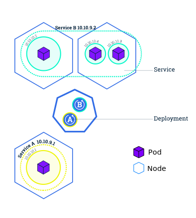

## Docker 相关组件

- [docker](https://github.com/docker/cli)：Docker 命令行工具，也是 Docker 客户端，负责将命令转为相应的 HTTP 请求去调用 Docker 服务端 API 接口。

- [dockerd](https://github.com/moby/moby)：Docker 服务端，提供 API 接口给客户端调用。

- [containerd](https://github.com/containerd/containerd)：负责管理容器的生命周期，如启动、停止、暂停、删除等。其本质上是将镜像转换成 OCI Bundle，然后交给 runc 去创建和启动容器。

- containerd-shim：作为容器内进程的根进程

- [runc](https://github.com/opencontainers/runc)：容器运行时（之前是 [libcontainer](https://github.com/docker-archive/libcontainer) 项目）。负责基于 OCI Bundle 来运行容器。

- [docker-proxy](https://github.com/moby/libnetwork)：dockerd 的子进程。负责容器端口映射的配置。

## Dockerfile 容易混淆的指令

**EXPOSE**：声明容器监听的端口。注意这仅仅只是声明，容器运行时并不会自动开启相应的端口。该指令有两个作用，一是告知使用者容器服务监听的端口，二是在容器使用随机端口映射时，也就是 `docker run -P` 时，会自动随机映射 EXPOSE 的端口。

**VOLUME**：定义存储卷。在存储卷上的操作会持久化到宿主机硬盘上，即使容器重启也不会丢失。存储卷默认会隐式挂载到宿主机的 `docker inspect CONTAINER_ID -f {{.GraphDriver.Data.UpperDir}}` 目录上。构建镜像时不声明 VOLUME ，也可以通过 `docker run -v <volume_name>:<path> ` 或 `docker run -v /path/in/host:<path>` 命令将容器的某个目录挂载到宿主机上（前者会将容器的目录 `<path>` 挂载到宿主机的 /var/lib/docker/volumes/<volume_name>/_data 目录）

**ENV**：定义容器运行时的环境变量。

**ARG**： 定义 Dockerfile 参数，镜像构建时通过 `docker build --build-arg <argName>=<value>` 传入。

**COPY**：复制文件。

**ADD**：复制文件。在 COPY 指令的基础上增加了两个功能，一个能下载 URL 上的文件，二是在复制压缩文件时，会自动解压。需要注意的是，ADD 会让镜像构建缓存失效，使镜像构建变慢。大部分情况下优先使用 COPY 指令，仅在自动解压的场合使用 ADD。

**RUN**：执行命令并创建新的镜像层，通常用于安装软件包。

**CMD**：设置容器启动后执行的命令及其参数。CMD 设置的命令能够被 `docker run <image>` 后面的命令替换。CMD 可为 ENTRYPOINT 提供额外的参数。

**ENTRYPOINT**：入口点，同 CMD，也是设置容器启动后执行的命令及其参数。一个 Dockerfile 中只能存在一个 ENTRYPOINT，如果存在多个 ENTRYPOINT，则只有最后一个生效。当存在 ENTRYPOINT 时，CMD 指令的内容将会作为参数传给 ENTRYPOINT。当执行 `docker run <image>` 时，`<image>` 后的所有命令都将作为参数传给 ENTRYPOINT，并覆盖 CMD 指令的内容。

**SHELL**：指定构建镜像时使用的默认 SHELL。默认情况下，Linux 镜像使用的 Shell 是 `SHELL ["/bin/sh", "-c"]` ，Windows 镜像使用的 Shell 是 `SHELL ["cmd", "/S", "/C"]` 。通常在构建 Windows 镜像时才会使用该指令，因为 Windows 同时存在  `cmd` 和 `powershell` 两种 Shell。

参考：

https://docs.docker.com/engine/reference/builder/

[Dockerfile RUN，CMD，ENTRYPOINT命令区别](https://www.jianshu.com/p/f0a0f6a43907)

## docker save|load|export|import

docker container export：将容器作为一个镜像导出成tar包；

docker image save|load|import：保存镜像成tar包|从tar包中加载镜像|从tar包中导入容器镜像，镜像的历史记录将清空，需手动指定标签，否则镜像标签为none

## Kubernetes 基本概念

### 集群

**Kubernetes cluster**

集群是一组节点，这些节点可以是物理机，也可以是虚拟机。集群节点主要分为以下两种

**Master**：主节点|控制节点，负责管理整个集群。Master 节点一般不用来运行应用实例。

**Node**：工作节点。负责运行应用实例。每个工作节点都会有一个 Kubelet 代理和 Docker 环境，前者负责和 Master 通信并管理工作节点，后者是运行 Docker 容器的必要环境。

 

参考：https://kubernetes.io/docs/tutorials/kubernetes-basics/create-cluster/cluster-intro/

### Pod

Pod：容器组，在容器的基础上**抽象**出来的概念，由一组容器、存储卷组成，每个 Pod 都有其独立的IP地址，Pod 内的所有容器共享其网络、存储卷。Pod 是 K8s 调度的最小单元，K8s是通过 Pod 来创建、运行和管理容器。

  

Pod 是运行在 Node 上，默认只能在集群内访问，对外不暴露IP地址，宿主机也访问不了。但是可以通过 kubectl proxy 命令创建代理来转发请求或通过 Service 来开启外部访问。

 

参考：https://kubernetes.io/docs/tutorials/kubernetes-basics/explore/explore-intro/ 

### Label

Label：标签，附加在资源对象（比如 Pod、Node、Service 等）上的键值对。控制器和 Service 就是通过标签来选择 Pod。

### Deployment

Deployment：部署控制器，可以确保任意时间都有指定数量的 Pod 副本在运行。Deployment 指挥 Kubernetes 如何创建和更新应用程序的实例。创建 Deployment 后，Kubernetes master 将应用程序实例调度到集群中的各个节点上。

参考：https://kubernetes.io/docs/tutorials/kubernetes-basics/deploy-app/deploy-intro/

  

### Service

Service：在 Pod 基础上**抽象**出来的概念，由一个 IP 地址（叫做 Cluster IP）和一组 Pod 组成，其通过标签来选择一组 Pod 来提供负载均衡功能。Service 默认只能在集群内访问，通过 Service 的 NodePort 方式也可以供集群外部应用访问。

 

Service 通过 Pod 上的 Label（标签）来对 Pod 进行分组：

  

参考：https://kubernetes.io/docs/tutorials/kubernetes-basics/expose/expose-intro/

### Job

通过一组 Pod 来完成指定任务，并在执行完成后退出。

### Volume

Kubernetes 中的 Volume 和 Docker 中的类似，但是还是有些区别。首先，Kubernetes 中的 Volume 是定义在 Pod 上，被 Pod 内的所有容器共享，与 Pod 同生命周期。

### Persistent Volume（PV）

PV 可以理解为网络存储，与 Volume 的区别是：

- PV 只能是网络存储，不属于任何 Node，但可以在每个 Node 上访问。

- PV 并不是被定义在 Pod 上的，而是独立于 Pod 之外定义的。

Pod 要想使用某个 PV，首先要先定义一个 PersistentVolumeClaim（PVC）资源对象，然后在 Pod 的 Volume 定义上引用 PVC 即可。

### 服务伸缩和滚动更新

服务伸缩：https://kubernetes.io/docs/tutorials/kubernetes-basics/scale/scale-intro/ 

滚动更新：https://kubernetes.io/docs/tutorials/kubernetes-basics/update/update-intro/ 

## Kubernetes 相关组件

**主节点上的组件**

kube-apiserver：负责提供 Kubernetes 各类资源对象（如 Pod、Service、Controller 等）的增、删、改、查、Watch等的 API 接口，供其它组件（如 kubectl、kubelet、kube-scheduler、kube-controller-manager）调用，是集群控制的唯一入口。

kube-scheduler：调度器。负责资源调度（资源指的是 Pod），根据约束和集群可用资源分配 Pod 到合适的节点上。

kube-controller-manager：控制器管理器。Kubernetes 集群的控制中心，内置一系列控制器如 ReplicationController、NodeController、ServiceController、EndpointController 等，负责提供自动化控制功能，控制集群状态为目标状态。

etcd：分布式 K-V 存储。负责集群各类资源对象的存储，以及维护集群各节点的状态和配置。

**工作节点上的组件**

kube-proxy：运行在每个 **Node** 上的网络代理（类似于 Nginx 代理），提供负载均衡和服务发现，负责将访问Service 的请求分配给 Pod。

kubelet：运行在每个 **Node** 上的代理程序，负责向 API Server 注册自身节点并定期汇报节点状态，以及监听 Pod 相关的事件来管理 Pod 和 Pod 内容器。

**其它组件**

coredns：提供 DNS 和服务发现功能

参考：

https://kubernetes.io/zh/docs/reference/command-line-tools-reference/kubelet/

https://kuboard.cn/learning/k8s-bg/component.html

https://docker_practice.gitee.io/zh-cn/kubernetes/setup/kubeadm.html#%E4%BF%AE%E6%94%B9-kubeletservice

## Kubernetes 相关工具

[kubectl](https://kubernetes.io/zh/docs/tasks/tools/install-kubectl/)：一个命令行工具，用来操控 Kubernetes 集群

[kubeadm](https://kubernetes.io/zh/docs/setup/production-environment/tools/kubeadm/install-kubeadm/)：一个命令行工具，用来部署 Kubernetes 集群

[Kompose](https://github.com/kubernetes/kompose) ：一个转换工具， 用来帮助 Docker Compose 用户迁移至 Kubernetes。

参考：https://kubernetes.io/zh/docs/reference/tools/

