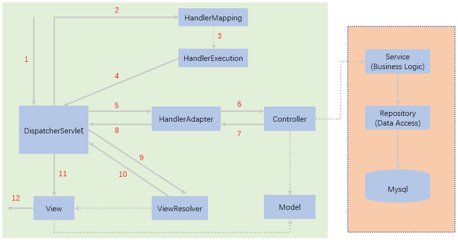

[TOC]


## 前言

Spring IOC、AOP、MVC、Boot、Cloud 微服务相关面试题统统放到这里。

## Spring、Spring MVC、Spring Boot、Spring Cloud的联系和区别

- Spring 是一个相对于 Java EE 来说更轻量级的 Web 开发框架，核心是控制反转（IOC）和面向切面（AOP）
- Spring MVC 是一个基于 Spring 的 MVC 框架，主要负责处理 web 开发中的路径映射和视图渲染
- Spring Boot 是 Spring 的一个快速开发框架，使用默认大于配置的理念，简化了 Spring 的繁琐配置，能快速开发微服务，内嵌 Servlet 容器，支持热更新和远程开发
- Spring Cloud 是基于 Spring Boot 并整合多个微服务开发组件的一个生态环境。

## 什么是 IOC？

IOC（Inversion Of Controll，控制反转）是一种设计思想，将创建对象的控制权交给 Spring 框架去管理，开发者无需考虑对象是如何创建的，无需处理对象复杂的依赖关系，只需要配置好配置文件或注解即可，大大降低了开发难度。

## 什么是 AOP？

AOP（Aspect-Oriented Programming，面向切面编程），是将与业务无关的、但是被业务模块所共同调用的代码（例如事务处理、日志管理、权限控制等）封装起来，放到一块去处理，做到减少重复代码，降低模块间的耦合度，便于扩展和维护

Spring AOP 基于动态代理，动态代理有两种实现方式，如果代理类实现了某个接口，就会使用 JDK 动态代理去创建代理对象，否则使用 CGlib 字节码操纵技术生成代理类的子类去创建代理对象。

## 动态代理的实现方式

动态代理的优点是在不改变原有类的基础上增强其功能。

动态代理有两种实现方式，一种是 JDK 动态代理，一种是 CGlib 动态代理。

- JDK 动态代理：基于反射机制实现，只有实现了接口的业务类才能生成代理对象。新版本也开始结合ASM机制。
- CGlib 动态代理：基于ASM机制实现，通过生成业务类的子类来创建代理对象。

## *IOC 容器如何实现？

要看 IOC 容器如何实现，要从最经典的IOC容器类 XmlBeanFactory 入手。

```java
BeanFactory bf = new XmlBeanFactory(new ClassPathResource("beanFactoryTest.xml"));
```

1. 将 XML 配置文件封装为 Resource
2. 然后将 Resource 逐步封装成 EncodedResource、InputSource、Document
3. 最后从 Document 中解析并注册 BeanDefinition

## *循环依赖问题

Spring 依赖注入的步骤：1.实例化 Bean 2.设置 Bean 的属性

循环依赖的场景下应该是A—B—A这样的顺序。

假设有两个对象，A和B，A依赖于B，B依赖于A。

当实例化A并设置A的属性时，发现A依赖于B，而B还没实例化，于是就实例化B，并设置B的属性，此时发现B依赖于A，而A又已经实例化，于是将A设置成B的属性。此时B已经实例化并设置属性完成，所以最后将B设置为A的属性即可，这样就解决了循环依赖的问题。

## *事务传播机制

Spring 定义的事务传播类型：

```
package org.springframework.transaction.annotation;

public enum Propagation {
    REQUIRED(0),// (默认)若当前存在事务，则加入该事务，若不存在事务，则新建一个事务。
    SUPPORTS(1),
    MANDATORY(2),
    REQUIRES_NEW(3),
    NOT_SUPPORTED(4),
    NEVER(5),
    NESTED(6);
}
```


1. PROPAGATION_REQUIRED
   若当前存在事务，则加入该事务，若不存在事务，则新建一个事务。

    ```java
    class C1(){
        @Transactional(propagation = Propagation.REQUIRED)
        function A(){
            C2.B();
        }
    }

    class C2(){
        @Transactional(propagation = Propagation.REQUIRED)
        function B(){
            do something;
        }
    }
    ```

    **若B方法抛出异常，A方法进行捕获，A会抛出异常，因为B要回滚，A要提交，产生冲突。**

    若**A或B**抛出异常，但没有捕获，则A、B都回滚（因为A和B处于同一个事务）。

    **A、B可操作同一条记录，因为处于同一个事务中。**

2. PAOPAGATION_REQUIRE_NEW
   若当前没有事务，则新建一个事务。若当前存在事务，则新建一个事务，新老事务相互独立。外部事务抛出异常回滚不会影响内部事务的正常提交。

   ```java
   class C1(){
       @Transactional(propagation = Propagation.REQUIRED)
       function A(){
           C2.B();
       }
   }
   
   class C2(){
       @Transactional(propagation = Propagation.REQUIRE_NEW)
       function B(){
           do something;
       }
   }
   ```

   若B方法抛出异常，A方法进行捕获，B方法回滚，A方法不受B异常影响。

   若B方法抛出异常，A、B方法都没有捕获，则A、B都会回滚。

   若A方法抛出异常，不会影响B正常执行。

   **A、B不可操作同一条记录，因为处于不同事务中，会产生死锁。**

3. PROPAGATION_NESTED
   如果当前存在事务，则嵌套在当前事务中执行。如果当前没有事务，则新建一个事务。类似 REQUIRED

   ```java
   class C1(){
       @Transactional(propagation = Propagation.REQUIRED)
       function A(){
           C2.B();
       }
   }
   
   class C2(){
       @Transactional(propagation = Propagation.NESTED)
       function B(){
           do something;
       }
   }
   ```

   若B方法抛出异常，A方法进行捕获，B方法回滚，A方法正常执行。（REQUIRED的A会抛出异常）

   若**A或者B**抛出异常，不做任何处理的话，A、B都要回滚。

   **A、B可操作同一条记录，因为处于同一个事务中。**


参考：

1. [spring事务传播机制和隔离级别](https://blog.csdn.net/qq_17085835/article/details/84837253)
2. [JavaGuide 33-事务属性详解](https://snailclimb.gitee.io/javaguide/#/docs/system-design/framework/spring/spring-transaction?id=_33-事务属性详解)

## Bean 的生命周期

Bean 的生命周期除了以下两步，还包括 14 + 3 步

1. 实例化 Bean
2. 设置 Bean 的属性值


Bean factory implementations should support the standard bean lifecycle interfaces as far as possible. The full set of initialization methods and their standard order is:

1. **如果 Bean 实现了 BeanNameAware 接口，则调用 Bean 的 setBeanName 方法**
2. 如果 Bean 实现了 BeanClassLoaderAware 接口，则调用 Bean 的 setBeanClassLoader 方法
3. **如果 Bean 实现了 BeanFactoryAware 接口，则调用 Bean 的 setBeanFactory 方法**
4. EnvironmentAware 's setEnvironment
5. EmbeddedValueResolverAware 's setEmbeddedValueResolver
6. ResourceLoaderAware 's setResourceLoader (only applicable when running in an application context)
7. ApplicationEventPublisherAware 's setApplicationEventPublisher (only applicable when running in an application context)
8. MessageSourceAware 's setMessageSource (only applicable when running in an application context)
9. **如果 Bean 实现了 ApplicationContextAware 接口，则调用 Bean 的 setApplicationContext 方法 (only applicable when running in an application context)**
10. 如果 Bean 实现了 ServletContextAware 接口，则调用 Bean 的 setServletContext 方法 (only applicable when running in a web application context)
11. **如果 Bean 实现了 BeanPostProcessor 接口，则调用 Bean 的 postProcessBeforeInitialization 方法**
12. **如果 Bean 实现了 InitializingBean 接口，则调用 Bean 的 afterPropertiesSet 方法**
13. **配置文件中 init-method 配置指定的初始化方法**
14. **如果 Bean 实现了 BeanPostProcessor 接口，则调用 Bean 的 postProcessAfterInitialization 方法**


On shutdown of a bean factory, the following lifecycle methods apply:

1. DestructionAwareBeanPostProcessor 的 postProcessBeforeDestruction 方法
2. **如果 Bean 实现了 DisposableBean 接口，则调用 Bean 的 destroy 方法**
3. **配置文件中 destroy-method 配置指定的销毁方法**


## Bean 的作用域

- **singleton** 单例：Spring 容器中自始至终只有一个 Bean 实例
- **prototype** 原型：每次从容器中获取 Bean 时，容器都会创建一个新的 Bean 实例
- **request**：每个 HTTP 请求，容器都会创建一个 Bean 实例，仅在当前 HTTP 请求中有效
- **session**：每个 HTTP Session，容器都会创建一个 Bean 实例，仅在当前 HTTP Session 中有效
- globalSession：每个全局的 HTTP Session，容器都会创建一个 Bean 实例，仅在使用 Portlet 上下文时有效
- websocket：为每个 websocket 对象创建一个实例，仅在 web 相关的 ApplicationContext 中有效
- application：为每个 ServletContext 对象创建一个实例，仅在 web 相关的 ApplicationContext 中有效

## Spring MVC 核心类说明

DispatcherServlet 前端控制器：拦截请求并调用 doService->doDispatch 方法处理

HandlerMapping 处理器映射：根据请求URL找到相应的 Handler

HandlerExecutionChain 处理器执行链：包装 Handler 和 HandlerInterceptor 处理器拦截器

Handler 处理器：让具体的 Controller 执行

HandlerAdapter 处理器适配器：执行 Handler

ModelAndView：包装 Model 和 View

ViewResolver 视图解析器：根据 ModelAndView 中的视图名称找到相应的视图

View 视图：根据 ModelAndView 中的 Model 渲染视图

## Spring MVC 的执行流程

当用户向服务器发送请求，被**前端控制器**（DispatcherServlet）拦截，前端控制器将请求交给处理器映射（HandlerMapping)，处理器映射根据请求 URL 找到相应的 Handler，然后将 Handler 和 HandlerInterceptor 一起封装成 HandlerExecutionChain处理器执行链 返回给前端控制器，前端控制器根据 Handler 找到相应的 HandlerAdapter 去执行，执行完后会返回 ModelAndView 给前端控制器，前端控制器再把 ModleAndView 交给 ViewResolver 视图解析器找到相应的 View 视图对象，View 根据 ModelAndView 的中的 Model 渲染视图，最后前端控制器把渲染后的视图返回给用户。

（执行 Handler 之前或之后 DispatcherServlet 会分别调用 HandlerExecutionChain 的 applyPreHandle 和 applyPostHandle 方法去执行注册过的 HandlerInterceptor）

流程图如下：




## Spring Boot 自动装配原理

基于条件注解

## 为什么使用 nacos？对比 eureka 的优点？

以下是俺的总结：

- 有管理界面，方便管理
- 支持配置中心，支持在线编辑并动态发布配置
- 支持配置的版本历史，方便回滚
- 支持命名空间，方便管理不同环境的配置和服务
- 支持对服务进行手动上下线，在线上环境可以对异常的服务进行下线，也在开发的时候方便进行调试
- 支持流量权重，将更多的流量分配给权重大的服务

## *注册中心如何实现

## *Gateway 和 Zuul 的区别