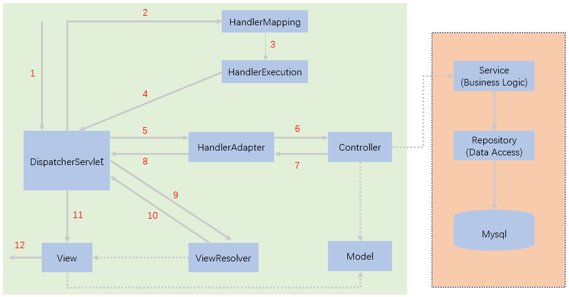

[TOC]


# 前言

JSP、Spring IOC、AOP、MVC、Boot、Cloud 微服务相关面试题统统放到这里。

# JSP 篇

## JSP 与 Servlet 的区别

1. JSP 经 ApplicationServer 编译后就是 Servlet
2. JSP 负责处理页面显示，Servlet 负责处理业务逻辑
3. Servlet 中没有内置对象，必须通过 HttpServletRequest 对象，HttpServletResponse 对象以及 HttpServlet 对象得到 JSP 中的内置对象。

## JSP 九大内置对象

| 内置对象    | 类型                | 作用                                                    |
| ----------- | ------------------- | ------------------------------------------------------- |
| request     | HttpServletRequest  | HTTP请求                                                |
| response    | HttpServletResponse | HTTP响应                                                |
| session     | HttpSession         | HTTP会话                                                |
| application | ServletContext      | 多个Servlet可以通过ServletContext对象来实现数据间的共享 |
| pageContext | PageContext         | 获取其他八个内置对象                                    |
| config      | ServletConfig       | 获取服务器的配置信息                                    |
| page        | Object(this)        | 代表JSP页面本身                                         |
| out         | JspWriter           | 在浏览器中打印信息                                      |
| exception   | Throwable           | 异常                                                    |

## Cookie

Cookie 的属性如下：

- Name/Value：Cookie 的名称及相对应的值。

- Expires/Max-Age（有效期）：如果缺省该值，则**默认为 Session，即 Cookie 在浏览器关闭时失效**。否则，Cookie 会持久化到硬盘上直到有效期结束或手动删除。

- HttpOnly：只能通过 HTTP 请求访问，不能通过 JS 脚本访问（如通过 JavaScript [`Document.cookie`](https://developer.mozilla.org/en-US/docs/Web/API/Document/cookie) API 访问），有助于保护 Cookie 不被跨站脚本攻击窃取或篡改。

- Secure：指定是否使用 HTTPS 安全协议发送 Cookie。使用 HTTPS 安全协议，可以保护 Cookie 在浏览器和Web服务器间的传输过程中不被窃取和篡改。
- Domain（作用域）：指定哪个域名能访问该 Cookie。如果缺省，则默认当前域名，不包括子域名。比如某个 Cookie 设置了 `Domain=mozilla.org` ，则子域名 `developer.mozilla.org` 也能访问该 Cookie。

- Path（作用域）：根据 URL 路径来匹配哪些请求能够携带该 Cookie。比如某个 Cookie 设置了 `Path=/docs` ，则以下 URL 路径的请求能携带该 Cookie：
  - `/docs`
  - `/docs/Web/`
  - `/docs/Web/HTTP`

- SameSite
- SameParty
- Priority

参考：

https://baike.baidu.com/item/cookie/1119

https://developer.mozilla.org/en-US/docs/Web/HTTP/Cookies

## Session

## Token

Token 又叫令牌，一般在登录、认证的场景下使用。

Token 使用步骤如下：

1. 当用户登录成功时，服务端会生成一个 Token，将其保存到 Redis，并返回给客户端；

2. 客户端拿到这个 Token 后，会保存到本地，下一次网络请求时会带上这个 Token；

3. 服务端接收到请求后，会将客户端的 Token 值与数据库的 Token 值对比

   - 存在，说明当前用户登录成功过，处于已登录状态
   - 不存在，说明没有登录成功过，或者是登录失效，需要重新登录

## Cookie、Session、Token的区别

Cookie、Session 和 Token 都是保持会话的方式，三者有一定的区别。


Cookie 和 Session 的区别：

- Cookie 是保存在浏览器上，而 Session 是保存在服务器上

- Cookie 有大小和数量限制；而 Session 理论上没有限制，实际上取决于服务器的内存大小

  一个 Cookie 的大小 4KB 左右（4095~4097字节之间），不同浏览器对 Cookie 数量的限制不同，以 IE 6 为例，每个域名能设置的 Cookie 总数不能超过 20 个。


Session 和 Token 的区别：

- Session 是基于 Cookie，需要借助 Cookie 来保存 SessionId。由于基于 Cookie，所以有 CSRF 攻击的风险
- Token 和 Session 原理差不多，但是 Token 可以保存在 Cookie、Local Storage 和 SessionStorage 中。并且 Token 是在请求头中手动携带，避免了 CSRF 攻击的风险。

参考：

https://www.jianshu.com/p/b4a9569823dd

https://www.cnblogs.com/belongs-to-qinghua/articles/11353228.html


## 跨域、CORS、CSRF

跨域是一种浏览器同源安全策略，即浏览器单方面限制脚本的跨域访问。发生跨域时，请求是可以正常发起，后端也能正常处理，但在返回的时候会被浏览器拦截掉，导致响应不可用。能论证这一点的著名案例就是 CSRF 攻击，因为即使发生跨域，仍然能够发起 CSRF 攻击，只要后端服务器能正常发起 CSRF 攻击的请求就达到了攻击的目的，响应可不可用没有关系。


CORS（Cross-Origin Resource Sharing，跨源资源共享）是处理跨域的一种方式，它由一系列 `Access-Control-*` 开头的 HTTP 头组成跨域请求的响应。其它处理跨域的方式有 JSONP、Nginx转发处理等。


CSRF（Cross Site Request Forgery，跨站请求伪造）是一种利用浏览器在发送请求时会自动携带登录态的 Cookie 而发起的安全攻击。


CORS 在处理跨域问题时，将请求分为两类，简单请求（simple request）和非简单请求（not-so-simple request）。

只要同时满足以下两大条件，就属于简单请求。

> （1) 请求方法是以下三种方法之一：
>
> - HEAD
> - GET
> - POST
>
> （2）HTTP的头信息不超出以下几种字段：
>
> - Accept
> - Accept-Language
> - Content-Language
> - Last-Event-ID
> - Content-Type：只限于三个值 `application/x-www-form-urlencoded`、`multipart/form-data`、`text/plain`

只要不同时满足上面两个条件，都属于非简单请求。比如 PUT、DELETE 请求，以及常见的 Content-Type 为 `application/json` 的请求。


简单请求在请求时会加 Origin 头声明请求来源，如果指定的源允许，服务器返回响应时会携带 **Access-Control-Allow-Origin** 头，否则不携带。

非简单请求在请求时需要先发送 OPTIONS 请求（预检请求），通过 Origin 头声明请求的来源、**Access-Control-Request-Method** 头声明 HTTP 请求方法，如 PUT 请求方法。如果确认允许跨域请求，服务器返回响应时会携带 **Access-Control-Allow-Methods** 头表明服务器支持的所有跨域请求的方法。


参考：

《Spring Security 实战》“第8章 跨域与CORS”、“第9章 跨域请求伪造的防护”

https://developer.mozilla.org/zh-CN/docs/Glossary/CORS

http://www.ruanyifeng.com/blog/2016/04/cors.html

## 如何防止表单重复提交

**一、有很多的应用场景都会遇到重复提交问题，比如**：

1、点击提交按钮两次。
2、点击刷新按钮。
3、使用浏览器后退按钮重复之前的操作，导致重复提交表单。
4、使用浏览器历史记录重复提交表单。
5、浏览器重复的 HTTP 请求。

二、**防止表单重复提交的方法**

1. 表单提交后将提交按钮设置为不可用。但是如果客户端禁止使用 JavaScript，这个方法无效。
2. Post/Redirect/Get 模式。表单提交后进行页面重定向，转到提交成功信息页面。
3. 数据库添加唯一索引。

参考：[如何防止表单重复提交](https://www.cnblogs.com/wenlj/p/4951766.html)

# Spring 篇

## Spring、Spring MVC、Spring Boot、Spring Cloud的联系和区别

- Spring 是一个相对于 Java EE 来说更轻量级的 Web 开发框架，核心是控制反转（IOC）和面向切面（AOP）
- Spring MVC 是一个基于 Spring 的 MVC 框架，主要负责处理 web 开发中的路径映射和视图渲染
- Spring Boot 是 Spring 的一个快速开发框架，使用默认大于配置的理念，简化了 Spring 的繁琐配置，能快速开发微服务，内嵌 Servlet 容器，支持热更新和远程开发
- Spring Cloud 是基于 Spring Boot 并整合多个微服务开发组件的一个生态环境。

## 什么是 IOC？

IOC（Inversion Of Controll，控制反转）是一种设计思想，将创建对象的控制权交给 Spring 框架去管理，开发者无需考虑对象是如何创建的，无需处理对象复杂的依赖关系，只需要配置好配置文件或注解即可，大大降低了开发难度。

## 什么是 AOP？

AOP（Aspect-Oriented Programming，面向切面编程），是将与业务无关的、但是被业务模块所共同调用的代码（例如事务处理、日志管理、权限控制等）封装起来，放到一块去处理，做到减少重复代码，降低模块间的耦合度，便于扩展和维护

Spring AOP 基于动态代理，动态代理有两种实现方式，如果代理类实现了某个接口，就会使用 JDK 动态代理去创建代理对象，否则使用 CGlib 字节码操纵技术生成代理类的子类去创建代理对象。

## 动态代理的实现方式

动态代理的优点是在不改变目标类的基础上增强其功能。

动态代理有两种实现方式，一种是 JDK 动态代理，一种是 CGlib 动态代理。

- JDK 动态代理：基于反射机制实现。只要目标对象实现了某个接口，就能生成目标对象的代理对象。新版本也开始结合 ASM 字节码操纵机制来实现动态代理。
- CGlib 动态代理：基于 ASM 字节码操纵机制实现，通过生成目标类的子类来生成代理对象。


## *IOC 容器如何实现？

要看 IOC 容器如何实现，要从最经典的IOC容器类 XmlBeanFactory 入手。

```java
BeanFactory bf = new XmlBeanFactory(new ClassPathResource("beanFactoryTest.xml"));
```

1. 将 XML 配置文件封装为 Resource
2. 然后将 Resource 逐步封装成 EncodedResource、InputSource、Document
3. 最后从 Document 中解析并注册 BeanDefinition

## *循环依赖问题

Spring 依赖注入的步骤：1.实例化 Bean 2.设置 Bean 的属性

循环依赖的场景下应该是A—B—A这样的顺序。

假设有两个对象，A和B，A依赖于B，B依赖于A。

当实例化A并设置A的属性时，发现A依赖于B，而B还没实例化，于是就实例化B，并设置B的属性，此时发现B依赖于A，而A又已经实例化，于是将A设置成B的属性。此时B已经实例化并设置属性完成，所以最后将B设置为A的属性即可，这样就解决了循环依赖的问题。

## Bean 的生命周期

Bean 的生命周期除了以下两步，还包括 14 + 3 步

1. 实例化 Bean
2. 设置 Bean 的属性值


Bean factory implementations should support the standard bean lifecycle interfaces as far as possible. The full set of initialization methods and their standard order is:

1. **如果 Bean 实现了 BeanNameAware 接口，则调用 Bean 的 setBeanName 方法**
2. 如果 Bean 实现了 BeanClassLoaderAware 接口，则调用 Bean 的 setBeanClassLoader 方法
3. **如果 Bean 实现了 BeanFactoryAware 接口，则调用 Bean 的 setBeanFactory 方法**
4. EnvironmentAware 's setEnvironment
5. EmbeddedValueResolverAware 's setEmbeddedValueResolver
6. ResourceLoaderAware 's setResourceLoader (only applicable when running in an application context)
7. ApplicationEventPublisherAware 's setApplicationEventPublisher (only applicable when running in an application context)
8. MessageSourceAware 's setMessageSource (only applicable when running in an application context)
9. **如果 Bean 实现了 ApplicationContextAware 接口，则调用 Bean 的 setApplicationContext 方法 (only applicable when running in an application context)**
10. 如果 Bean 实现了 ServletContextAware 接口，则调用 Bean 的 setServletContext 方法 (only applicable when running in a web application context)
11. **如果 Bean 实现了 BeanPostProcessor 接口，则调用 Bean 的 postProcessBeforeInitialization 方法**（Initialization 指的是下面的”步骤13“）
12. **如果 Bean 实现了 InitializingBean 接口，则调用 Bean 的 afterPropertiesSet 方法**（该接口方法是会在 Bean 所有的属性都设置之后调用，可以在此处添加自定义初始化，或检查是否已设置所有必需属性）
13. **XML 配置文件中的 init-method 配置所指定的初始化方法**
14. **如果 Bean 实现了 BeanPostProcessor 接口，则调用 Bean 的 postProcessAfterInitialization 方法**（Initialization 指的是上面的”步骤13“）


On shutdown of a bean factory, the following lifecycle methods apply:

1. DestructionAwareBeanPostProcessor 的 postProcessBeforeDestruction 方法
2. **如果 Bean 实现了 DisposableBean 接口，则调用 Bean 的 destroy 方法**
3. **XML 配置文件中的 destroy-method 配置所指定的销毁方法**


## Bean 的作用域

- **singleton** 单例：Spring 容器中自始至终只有一个 Bean 实例
- **prototype** 原型：每次从容器中获取 Bean 时，容器都会创建一个新的 Bean 实例
- **request**：每个 HTTP 请求，容器都会创建一个 Bean 实例，仅在当前 HTTP 请求中有效
- **session**：每个 HTTP Session，容器都会创建一个 Bean 实例，仅在当前 HTTP Session 中有效
- globalSession：每个全局的 HTTP Session，容器都会创建一个 Bean 实例，仅在使用 Portlet 上下文时有效
- websocket：为每个 websocket 对象创建一个实例，仅在 web 相关的 ApplicationContext 中有效
- application：为每个 ServletContext 对象创建一个实例，仅在 web 相关的 ApplicationContext 中有效


## 配置读取

配置一般存在 Property 中，这里的 Property 指 properties 文件、yaml 文件等以键值对形式存储数据的文件。

PropertyResolver 接口 -> ConfigurablePropertyResolver 接口 -> AbstractPropertyResolver -> PropertySourcesPropertyResolver

PropertyResolver 接口 -> Environment 接口 -> ConfigurableEnvironment 接口 -> AbstractEnvironment -> StandardEnvironment

PropertyResolver 处理占位符最终是调用 PropertyPlaceholderHelper 工具类


**PropertyResolver 的 `resolvePlaceholders()` 和 `getProperty()` 的区别**

`resolvePlaceholders()` 的入参是占位符，即 `${}` 。它有如下特点：

1. 若占位符里面的 key 不存在，就原样输出，不报错。若存在就使用值替换。
2. 如果入参不是占位符，则原样输出~~
3. 若是 `resolveRequiredPlaceholders()` 方法，占位符不存在就会抛错~

`getProperty()` 的入参是 key，不是占位符

1. 若根据 key 解析出 value 不为空，还会继续调用  `resolveRequiredPlaceholders()` 方法解析里面的占位符。若占位符不存在就会抛错。
2. `getRequiredProperty()` 方法若key不存在就直接报错了~


StringValueResolver 接口 -> EmbeddedValueResolver，负责解析字符串、SpEL 表达式。其最终调用的是 PropertySourcesPropertyResolver。


参考：

[关于Spring属性处理器PropertyResolver以及应用运行环境Environment的深度分析，强大的StringValueResolver使用和解析【享学Spring】](https://blog.csdn.net/f641385712/article/details/91380598)

[【小家Spring】Spring中@Value注解有多强大？从原理层面去剖析为何它有如此大的“能耐“](https://blog.csdn.net/f641385712/article/details/91043955)

[【小家Spring】SpEL你感兴趣的实现原理浅析spring-expression~(SpelExpressionParser、EvaluationContext、rootObject)](https://blog.csdn.net/f641385712/article/details/90812967)

[【小家Spring】Spring中读取配置的方式，@Value、@PropertySource、@ConfigurationProperties使用详解](https://blog.csdn.net/f641385712/article/details/84452191)

## 事务篇

先看这几篇文章：

[【小家java】spring事务不生效的原因大解读](https://blog.csdn.net/f641385712/article/details/80445933)

[【小家java】Spring事务嵌套引发的血案---Transaction rolled back because it has been marked as rollback-only](https://fangshixiang.blog.csdn.net/article/details/80445912)

[【小家Spring】源码分析Spring的事务拦截器：TransactionInterceptor和事务管理器：PlatformTransactionManager](https://blog.csdn.net/f641385712/article/details/89673753)

主要认识到以下这点：

> 在同一个类中**一个无事务的方法调用另一个有事务的方法，事务是不会生效的**（这就是业界老问题：类内部方法调用事务不生效的问题原因）
>
> 这是因为不是通过代理对象来调用有事务的方法。解决方法：内部维护一个注入自己的Bean，然后通过这个属性来调用方法。

### *事务传播机制

TransactionDefinition 中定义了7种事务传播机制。

```java
package org.springframework.transaction.annotation;

public enum Propagation {
    REQUIRED(0),// (默认)若当前存在事务，则加入该事务，若不存在事务，则新建一个事务。
    SUPPORTS(1),
    MANDATORY(2),
    REQUIRES_NEW(3),
    NOT_SUPPORTED(4),
    NEVER(5),
    NESTED(6);
}
```


1. PROPAGATION_REQUIRED
   若当前存在事务，则加入该事务，若不存在事务，则新建一个事务。

    ```java
    class C1(){
        @Transactional(propagation = Propagation.REQUIRED)
        function A(){
            C2.B();
        }
    }
   
    class C2(){
        @Transactional(propagation = Propagation.REQUIRED)
        function B(){
            do something;
        }
    }
    ```

    **若B方法抛出异常，A方法进行捕获，A会抛出异常，因为B要回滚，A要提交，产生冲突。**

    若**A或B**抛出异常，但没有捕获，则A、B都回滚（因为A和B处于同一个事务）。

    **A、B可操作同一条记录，因为处于同一个事务中。**

2. PAOPAGATION_REQUIRE_NEW
   若当前没有事务，则新建一个事务。若当前存在事务，则新建一个事务，新老事务相互独立。外部事务抛出异常回滚不会影响内部事务的正常提交。

   ```java
   class C1(){
       @Transactional(propagation = Propagation.REQUIRED)
       function A(){
           C2.B();
       }
   }
   
   class C2(){
       @Transactional(propagation = Propagation.REQUIRE_NEW)
       function B(){
           do something;
       }
   }
   ```

   若B方法抛出异常，A方法进行捕获，B方法回滚，A方法不受B异常影响。

   若B方法抛出异常，A、B方法都没有捕获，则A、B都会回滚。

   若A方法抛出异常，不会影响B正常执行。

   **A、B不可操作同一条记录，因为处于不同事务中，会产生死锁。**

3. PROPAGATION_NESTED
   如果当前存在事务，则嵌套在当前事务中执行。如果当前没有事务，则新建一个事务。类似 REQUIRED

   ```java
   class C1(){
       @Transactional(propagation = Propagation.REQUIRED)
       function A(){
           C2.B();
       }
   }
   
   class C2(){
       @Transactional(propagation = Propagation.NESTED)
       function B(){
           do something;
       }
   }
   ```

   若B方法抛出异常，A方法进行捕获，B方法回滚，A方法正常执行。（REQUIRED的A会抛出异常）

   若**A或者B**抛出异常，不做任何处理的话，A、B都要回滚。

   **A、B可操作同一条记录，因为处于同一个事务中。**


参考：

1. [spring事务传播机制和隔离级别](https://blog.csdn.net/qq_17085835/article/details/84837253)
2. [JavaGuide 33-事务属性详解](https://snailclimb.gitee.io/javaguide/#/docs/system-design/framework/spring/spring-transaction?id=_33-事务属性详解)

# MVC 篇

## Spring MVC 核心类说明

DispatcherServlet 前端控制器：拦截请求并执行 doService->doDispatch 方法。Dispatch 是分发、调度的意思，就是将请求分发给 Handler 来处理。

Handler：表现形式有 Servlet、Controller 接口、HandlerMethod（即 @RequestMapping 标记的方法）、HttpRequestHandler 和 HandlerFunction（5.2版本新增）。

HandlerMapping 处理器映射接口：存放请求与 Handler 的对应关系，并提供 getHandler 方法来根据请求找到对应的 Handler（和 HandlerInterceptor 一起封装在 HandlerExecutionChain 中返回）。@RequestMapping 与 HandlerMethod 的对应关系存放在 AbstractHandlerMethodMapping 类的 mappingRegistry 中，其中 @RequestMapping 以 RequestMappingInfo 类的形式保存。

HandlerExecutionChain 处理器执行链：封装 Handler 和 HandlerInterceptor 处理器拦截器。

HandlerAdapter 处理器适配器接口：负责执行 Handler。根据 `Handler` 来找到支持它的 `HandlerAdapter`，通过 `HandlerAdapter` 执行这个 `Handler` 得到 `ModelAndView` 对象。HandlerAdapter 对应 Handler 的五种表现形式分别有 SimpleServletHandlerAdapter、SimpleControllerHandlerAdapter、HttpRequestHandlerAdapter、HandlerFunctionAdapter、AbstractHandlerMethodAdapter 这五个实现类，前三个类的实现非常简单，都是对请求直接处理，没有参数校验、返回值处理等功能。最后一个类的子类 RequestMappingHandlerAdapter 才是我们最常用的，也是功能最多的。

ModelAndView：封装 Model 和 View。

ViewResolver 视图解析器：根据 ModelAndView 中的视图名称找到相应的视图。

View 视图：根据 ModelAndView 中的 Model 渲染视图。


参考：https://fangshixiang.blog.csdn.net/article/details/89844141

## Spring MVC 的执行流程

当用户向服务器发送请求，被**前端控制器**（DispatcherServlet）拦截，前端控制器将请求交给处理器映射（HandlerMapping)，处理器映射根据请求 URL 找到相应的 Handler，然后将 Handler 和 HandlerInterceptor 一起封装成 HandlerExecutionChain处理器执行链 返回给前端控制器，前端控制器根据 Handler 找到相应的 HandlerAdapter 去执行，执行完后会返回 ModelAndView 给前端控制器，前端控制器再把 ModleAndView 交给 ViewResolver 视图解析器找到相应的 View 视图对象，View 根据 ModelAndView 的中的 Model 渲染视图，最后前端控制器把渲染后的视图返回给用户。

（执行 Handler 之前或之后 DispatcherServlet 会分别调用 HandlerExecutionChain 的 applyPreHandle 和 applyPostHandle 方法去执行注册过的 HandlerInterceptor）

流程图如下：



## *请求映射

请求映射是将请求映射到处理该请求的方法上。

## *参数解析

请求映射后，还要从请求中解析出方法的入参，才能让处理该请求的方法执行。在参数解析的过程中，还会伴随着**数据转换**（比如请求参数中传的是日期字符串，而方法入参是日期类型，则需要将字符串转换为日期类型）、**数据绑定**（比如方法入参是个实体类，则需要将请求参数绑定到实体类的属性中）。

参数解析的位置：

HandlerAdapter#handle -> AbstractHandlerMethodAdapter#handle -> RequestMappingHandlerAdapter#handleInternal -> RequestMappingHandlerAdapter#invokeHandlerMethod -> ServletInvocableHandlerMethod#invokeAndHandle


ServletInvocableHandlerMethod#invokeAndHandle 方法中会调用以下两个接口来处理请求参数和返回值：

- HandlerMethodArgumentResolver：负责解析 HTTP 请求参数并传递给处理器方法。
- HandlerMethodReturnValueHandler：负责处理处理器方法返回值。

## *数据转换

[【小家Spring】聊聊Spring中的数据转换类：Converter、ConverterFactory、ConversionService、ConversionServiceFactoryBean](https://blog.csdn.net/f641385712/article/details/90702928)

[【小家Spring】聊聊Spring中的格式化：Formatter、AnnotationFormatterFactory、DateFormatter以及@DateTimeFormat...](https://blog.csdn.net/f641385712/article/details/90758540)

## *数据绑定

PropertyAccessor 接口 -> ConfigurablePropertyAccessor 接口 -> AbstractPropertyAccessor 抽象类 -> AbstractNestablePropertyAccessor 抽象类 -> **DirectFieldAccessor | BeanWrapperImpl**

PropertyAccessor 接口 -> ConfigurablePropertyAccessor 接口 ->BeanWrapper 接口 -> **BeanWrapperImpl**

PropertyAccessorFactory 负责生成 DirectFieldAccessor 和 BeanWrapperImpl 实例

Introspector 内省与反射的区别：内省是针对 JavaBean，设置属性值时肯定会调用其 setter 方法，而反射是针对所有类，且设置属性值时不一定要调其 setter 方法，因为可以直接操作字段来设置值。

DataBinder 的数据绑定最终依赖于 PropertyAccessor#setPropertyValues 方法。

参考：

[聊聊Spring中的数据绑定 --- 属性访问器PropertyAccessor和实现类DirectFieldAccessor的使用【享学Spring】](https://blog.csdn.net/f641385712/article/details/95481552)

[聊聊Spring中的数据绑定 --- BeanWrapper以及Java内省Introspector和PropertyDescriptor【享学Spring】](https://blog.csdn.net/f641385712/article/details/95907073)

[聊聊Spring中的数据绑定 --- DataBinder本尊（源码分析）【享学Spring】](https://blog.csdn.net/f641385712/article/details/96431460)

[【小家Spring】聊聊Spring中的数据转换：Converter、ConversionService、TypeConverter、PropertyEditor](https://blog.csdn.net/f641385712/article/details/90702928)

[从原理层面掌握@InitBinder的使用【享学Spring MVC】](https://blog.csdn.net/f641385712/article/details/95473929)

[聊聊Spring中的数据绑定 --- WebDataBinder、ServletRequestDataBinder、WebBindingInitializer...【享学Spring】](https://blog.csdn.net/f641385712/article/details/96450469)

## *返回值处理

RestController 返回值处理流程如下：

1. RequestResponseBodyMethodProcessor#handleReturnValue
2. AbstractMessageConverterMethodProcessor#writeWithMessageConverters 
3. RequestResponseBodyAdviceChain#beforeBodyWrite
4. 遍历所有的 HttpMessageConverter，选择合适的 HttpMessageConverter 调用其 write 方法。在 write 方法里就已经将序列化后的结果 flush 到输出流。

## HttpServletRequest 推荐获取方式

推荐使用 `@Autowired` 依赖注入获取，除非不能依赖注入，才通过 `((ServletRequestAttributes) RequestContextHolder.getRequestAttributes()).getRequest()` 获取。


提问：

1. Spring 何时把 Request 上下文放进 RequestContextHolder？

   在 FrameworkServlet#processRequest 中，即在 FrameworkServlet#doService 的前后通过 initContextHolders 和 resetContextHolders 初始化和释放 Request 上下文。

2. @Autowired 注入的 HttpServletRequest 为啥是动态代理对象？

   **所有的 @Autowired 进来的JDK动态代理对象的 InvocationHandler 处理器均为 AutowireUtils.ObjectFactoryDelegatingInvocationHandler，其里面 invoke 调用的实例是来自于objectFactory.getObject()** 。而 HttpServletRequest 使用的 ObjectFactory 是 WebApplicationContextUtils.RequestObjectFactory，之所以是这个，是因为在 web 容器初始化时调用的 WebApplicationContextUtils.registerWebApplicationScopes 里设置了 HttpServletRequest 的实例要用 RequestObjectFactory 来生成。而 RequestObjectFactory 中返回的 HttpServletRequest 实例，恰恰是从 RequestContextHolder 中来的。

参考：

[Spring注入的成员属性HttpServletRequest是线程安全的吗？【享学Spring MVC】](https://fangshixiang.blog.csdn.net/article/details/104579949)

# Security 篇

官方文档：https://docs.spring.io/spring-security/site/docs/current/reference/html5

Security 相关的异常状态码：

- 401错误：认证失败。表示没有这个用户，或密码错误。
- 403错误：授权失败。表示认证通过但授权失败，即用户没有相应权限。


源码入口-配置：springSecurityFilterChain Bean 的配置。位于 WebSecurityConfiguration 类中，其实就是配置 FilterChainProxy。FilterChainProxy 持有多个 SecurityFilterChain，而 SecurityFilterChain 持有多个 Security 过滤器。多个 SecurityFilterChain 也有先后顺序，比如如果配置了 OAuth2，则默认先后顺序为：授权服务器的 > 资源服务器 > WebSecurity（默认最低）

源码入口-认证流程：FilterChainProxy-> SecurityFilterChain-> Security Filters-> AuthenticationManager-> ProviderManager-> AuthenticationProvider

源码入口-授权流程：FilterSecurityInterceptor-> AccessDecisionManager-> AccessDecisionVoter

源码入口-认证流程-表单登录认证：**UsernamePasswordAuthenticationFilter**-> AuthenticationManager-> ProviderManager-> AuthenticationProvider-> **AbstractUserDetailsAuthenticationProvider**-> **DaoAuthenticationProvider**-> **UserDetailsService**-> **UserDetails**

源码入口-认证流程-HTTP基本认证：BasicAuthenticationFilter->


DaoAuthenticationProvider 主要有以下两个功能：

1. 获取用户信息：通过 UserDetailsService 接口获取用户信息，该接口可以自定义实现。
2. 验证密码是否正确


## OAuth2

配置入口：

源码入口-OAuth2-授权码登录：访问 /oauth2/authorization/{registrationId}-> **OAuth2AuthorizationRequestRedirectFilter**-> 重定向授权URL-> 用户点击授权-> 回调 redirectUrl-> **OAuth2LoginAuthenticationFilter**-> AuthenticationManager-> ProviderManager-> AuthenticationProvider-> **OAuth2LoginAuthenticationProvider**

源码入口-OAuth2-资源服务器：OAuth2AuthenticationProcessingFilter-> OAuth2AuthenticationManager-> ResourceServerTokenServices。ResourceServerTokenServices 常见实现类如下：

- DefaultTokenServices：资源服务器和授权服务器在同一个服务中。如果访问令牌是JWT类型，也是这个实现类
- RemoteTokenServices：资源服务器独立于授权服务器，且使用 security.oauth2.resource.token-info-uri 配置
- UserInfoTokenServices：资源服务器独立于授权服务器，且使用 security.oauth2.resource.user-info-uri 配置

源码入口-OAuth2-授权服务器：

- AuthorizationEndpoint：授权码模式请求授权码
  - GET /oauth/authorize 端点：接收授权码请求
  - POST /oauth/authorize 端点：用户批准授权后进入该端点
- TokenEndpoint：请求访问令牌
  - /oauth/token 端点：如果开启了表单客户端认证，客户端模式会先走 ClientCredentialsTokenEndpointFilter，再走这里
- CheckTokenEndpoint：检查访问令牌有效性
  - /oauth/check_token 端点

- WhitelabelApprovalEndpoint：显示用户批准页
  - /oauth/confirm_access 端点
- WhitelabelErrorEndpoint：显示错误页
  - /oauth/error 端点
- TokenKeyEndpoint：访问令牌是 JWT 格式的话，会走这里
  - /oauth/token_key 端点


OAuth2AuthorizationRequestRedirectFilter 主要有以下两个功能：

1. 通过 OAuth2AuthorizationRequestResolver 解析授权请求
2. 保存授权请求到 AuthorizationRequestRepository
3. 重定向至用户授权地址

OAuth2LoginAuthenticationProvider 主要有以下两个功能：

1. 通过授权码交换访问令牌：通过 OAuth2AccessTokenResponseClient 接口请求 tokenUri，默认实现类是 DefaultAuthorizationCodeTokenResponseClient，也可自定义实现 OAuth2AccessTokenResponseClient 接口。
2. 通过访问令牌请求用户信息：通过 OAuth2UserService 接口请求 userInfoUri，默认实现类是 DefaultOAuth2UserService，返回结果是 OAuth2User 接口类。OAuth2UserService 和 OAuth2User 均可自定义实现。


# Boot 篇

## Spring Boot 启动流程？

## Spring Boot 自动装配原理

基于条件注解

## CommandLineRunner 和 ApplicationRunner

**区别**

两者的区别是接收的参数类型不一样，前者入参是 String，后者是 ApplicationArguments。Spring Boot 在调用 callRunner 方法时会将 ApplicationArguments 转换成 String 给 CommandLineRunner。

**源码分析**

SpringApplication.run 方法在设置并刷新 ApplicationContext 后，会调用 callRunners 方法遍历 CommandLineRunner 接口和 ApplicationRunner 接口的实例，并调用 AnnotationAwareOrderComparator.sort 方法排序（可以利用 @Order 注解或者实现 Order 接口来设置所有 Runner 实例的运行顺序），最后运行它们的 run 方法（类似于开机自启）。

**与 `ApplicationListener<ContextRefreshedEvent>` 的区别**

1. Runner 是在 SpringApplication 启动的最后才被执行，而 `ApplicationListener<ContextRefreshedEvent>` 是在 ApplicationContext 被 refreshed 后执行。
2. 注意 Runner 是 Spring Boot 中引入的类，而 ApplicationListener 是 Spring 中引入的类，早于 Runner。
3. ContextRefreshedEvent 继承的是 ApplicationEvent，更多 ApplicationEvent 发送的顺序请看[这里](https://docs.spring.io/spring-boot/docs/current/reference/htmlsingle/#features.spring-application.application-events-and-listeners)。
4. Spring 建议不要在 ApplicationListener 中执行时间较长的任务，推荐使用 Runner 来执行这些任务。


参考：

[CommandLineRunner和ApplicationListener原理分析](https://blog.csdn.net/qq_32332777/article/details/106018279)

[理解 Spring ApplicationListener](https://blog.csdn.net/liyantianmin/article/details/81017960)

# Cloud 篇

## 为什么使用 nacos？对比 eureka 的优点？

以下是俺的总结：

- 有管理界面，方便管理
- 支持配置中心，支持在线编辑并动态发布配置
- 支持配置的版本历史，方便回滚
- 支持命名空间，方便管理不同环境的配置和服务
- 支持对服务进行手动上下线，在线上环境可以对异常的服务进行下线，也在开发的时候方便进行调试
- 支持流量权重，将更多的流量分配给权重大的服务

## *注册中心如何实现

## *Gateway 和 Zuul 的区别