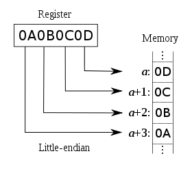

[toc]

## Big-Endian 与 Little-Endian

先来解释一下什么叫

**最高有效位 MSB: Most Significant Bit**

最高有效位(MSB)，即最左边的位，是一个n位二进制数字中的n-1位，这个位有最高的权重(2^(n-1))。在十进制中，5621中的5就是最高有效位。 

**最低有效位 LSB: Least Significant Bit**

最低有效位(LSB)，即最右边的位，是一个二进制数的整数位，这个位决定了这个数是偶数还是奇数。在十进制中，5621中的1就是最低有效位。

**大端 Big-Endian**

低地址存最高有效位(MSB)。Java 虚拟机中使用的就是大端 Big-Endian。

**小端 Little-Endian**

低地址存最低有效位(LSB)。

参考：[字节序（Endian），大端（Big-Endian），小端（Little-Endian）](https://yq.aliyun.com/articles/228000)

